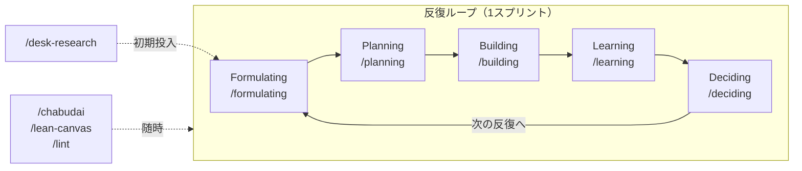

# 仮説検証Wiki — スキーマ

このリポジトリは、仮説検証活動（CPF→FPF→PSF→SPF→PMF）を通じて育てるLLM-wikiである。
AIはこのファイルの規約に従って「規律あるWikiの保守者」として振る舞う。

## プロジェクト（案件単位）

仮説検証は**案件（プロジェクト）単位**で分ける。各プロジェクトは `projects/<slug>/` 配下に
自分の `sources/`（生データ）と `wiki/`（生成・保守層）を持つ。スキーマ層はリポジトリ全体で共有する。
現在アクティブなプロジェクトは各自ローカルの `.env` の `CURRENT_PROJECT=<slug>`（未設定なら `self`）が指す
（`.env` は gitignore・書式はリポ直下の `.env.example`）。スキルはまずこの `.env` を読み、`projects/<slug>/` 配下を対象に動く（詳細は `projects/README.md`）。

以下このスキーマで `sources/` `wiki/` と書くときは、断りがなければ**現在のプロジェクトの
`projects/<slug>/sources/`・`projects/<slug>/wiki/`** を指す。

## 3層アーキテクチャ

| 層 | 場所 | 編集権 |
|---|---|---|
| Raw Sources（不変層） | `projects/<slug>/sources/` | 人間または `/learning` が生データを置く。AIは**コミット済みの生データを改変しない**（新規追加・未コミットの下書きの修正は可） |
| The Wiki（生成・保守層） | `projects/<slug>/wiki/` | AIが規約に従って作成・更新する |
| The Schema（設定層） | `ontology.yaml`（型・関係の正本）・`CLAUDE.md`・`AGENTS.md`（他エージェント向け入口）・`playbooks/`・`templates/`・`.claude/skills/` | 人間が合意の上で変更する（全プロジェクト共有） |

## オントロジー（型・関係の正本）

レコードの**型**（エンティティ H/TEST/LEARN/DEC とサブタイプ）、**付随物**（attachments。レコードではないが
型付きリンクに参加する従属成果物。現在は SCRIPT のみ。下記「スクリプト（付随物）」）、レコード間の**型付きリンク**（関係）、
**構造化フィールド**（行の集まりを持つ frontmatter キー。`judgments`＝仮説ごとの判定・`success-criteria`＝成功基準の
機械可読な背骨・`measurements`＝実測。下記「判定の粒度と成功基準」）、
検証の**状態機械**（ステージ・ステータス・確信度・証拠の階梯）、および**リーンキャンバスの仮説検証への写像**
（9ブロック↔仮説role・block-status・stage-lens。`/lean-canvas` が使う。レコードでなくビュー）は、
[ontology.yaml](ontology.yaml) が唯一の正本（SSoT）である。人間可読な要約は [ontology.md](ontology.md)
（`python3 tools/gen_ontology_doc.py` で生成・手編集禁止）。ツール（`tools/hwlint.py`・`tools/gen_views.py`）は
`tools/ontology.py` 経由でここを読むため、**語彙(enum)・関係・重点タイプ等をコードや本CLAUDE.mdに再定義しない**
（二重管理・ドリフト防止）。

**関係（型付きリンク）** は7種。各々 domain（始点の型）→ range（終点の型）・cardinality・inverse（逆方向の呼称）を
`ontology.yaml` の `relations` で宣言する。`derived-from`（H→H・派生元）／`leads-to`（H→H・因果先）／
`addresses`（ソリューション仮説→課題仮説・対応課題）／`hypotheses`（TEST・LEARN・SCRIPT→H・検証対象）／
`script-for`（SCRIPT→TEST・対象の実験計画）／
`learns-from`（LEARN→TEST・実施した実験計画）／`based-on`（DEC→TEST・LEARN・根拠活動/学び）。関係は原則 frontmatter 配列と本文 wikilink の**二重表現**を持つ（`addresses` のみ `must-wikilink: false` で frontmatter のみ。下記「スキル共通規約」3）。
`/lint` は各関係を宣言（domain/range/cardinality）に照らして検証し、ビュー生成（`tools/gen_views.py`）の `relations` ビューが全関係型をグラフ化する。

## スキル共通規約（全スキルが従う入口）

`.claude/skills/` の各スキルは、冒頭でこの節を参照し**そのスキル固有の手順だけ**を書く（下記の規約を各スキルにコピーしない＝二重管理・ドリフト防止）。

1. **プロジェクト解決** — まず `.env` の `CURRENT_PROJECT=<slug>`（未設定・`.env` 無しなら `self`）を読み、接頭辞（PREFIX）は当該プロジェクトの既存レコードID（無ければ `slug` の大文字）から導出する。解決は `tools/project.py` の `resolve_current_project` が正本（`--project` で上書き可）。以降 `sources/` `wiki/` は `projects/<slug>/` 配下を指す。`/lint` とビュー生成（`tools/gen_views.py`）は現在プロジェクトのみを対象にする。ステージが要るスキルは `wiki/stage.md` と対応する `playbooks/<stage>.md` も読む。
2. **ID・接頭辞** — ID＝ファイル名＝frontmatter `id` を三者一致させ、すべてプロジェクト接頭辞つき（例 `SELF-H-001`）。採番は種別×プロジェクトごとの既存最大+1。再利用禁止（取り下げた番号は欠番として残す）。
3. **リンク記法** — 接頭辞つきノート間の相互参照は**必ず本文に wikilink**（`[[SELF-H-001]]`。frontmatter 配列だけではObsidianグラフに辺が出ない）。schema層（`playbooks/`・`CLAUDE.md` 等の非ノート）は**相対mdリンク**で書く（wikilinkは解決せずリンク切れになる）。`../` の深さは**参照元ファイルの位置で変わる**:

   | 参照元の位置 | 深さ | 例 |
   |---|---|---|
   | `wiki/` 直下（`stage.md`・`index.md`） | `../../../` | `[playbooks/cpf.md](../../../playbooks/cpf.md)` |
   | `wiki/<種別>/` 配下（H・TEST・LEARN・DEC） | `../../../../` | `[playbooks/cpf.md](../../../../playbooks/cpf.md)` |
4. **.gitkeep** — 空ディレクトリ雛形の `.gitkeep` は、そのディレクトリに最初のレコードを作成したら削除してよい（任意）。
5. **承認規律** — 確信度・ステータスの変更は必ず 学び(LEARN)か意思決定(DEC) に紐づけ、**提案 → ユーザー承認 → 反映**する（不変ルール参照）。非対話/バッチ実行では、①成功基準の判定が機械的に〈支持〉/〈反証〉に定まり（＝TEST の `success-criteria` と LEARN の `measurements` が揃い、全基準が同じ向きに出ている。散文の成功基準しか無いなら「機械的に定まる」を満たさない）、②提案する確信度が証拠の階梯（下記「確信度とステータス」）の範囲に収まる場合に限り、提案内容を明示のうえ自動反映してよい。〈判断保留〉や、解釈を要する／証拠の階梯を超える引き上げは、必ず対話で承認を得る。

## レコード種別とスキーマ

すべてのレコードは `templates/` の雛形に従う。ファイル名は**IDそのもの**で、**プロジェクト接頭辞つき**
（例 `SELF-H-001.md`）。Obsidian のwikilinkはファイル名がvault全体で一意でないと解決しないため、
接頭辞 `<PREFIX>-` で衝突を防ぐ。frontmatter の **`id` はファイル名と完全に一致させる**（接頭辞つき。
例 `id: SELF-H-001`）。タイトルはfrontmatter `title` と本文H1に持つ。
相互参照は**必ず本文にwikilink**（`[[SELF-H-001]]`）で書く
（frontmatter配列だけではObsidianグラフに辺が現れないため）。

なお、schema層（`playbooks/`・`CLAUDE.md` など vault 内の接頭辞つきノートでないファイル）への参照は
**wikilinkではなく相対mdリンク**で書く。`../` の深さは参照元ファイルの位置で変わる（上記「スキル共通規約」3を参照。
`wiki/` 直下は `../../../`、`wiki/<種別>/` 配下の H・TEST・LEARN・DEC は `../../../../`）。

> **フィールド定義の正本は [ontology.yaml](ontology.yaml) の `entities.*.fields`**。各フィールドは**自己記述的**で、
> 必須／省略可・kind（値の種別）・語彙・既定値に加えて **`description`（何を書くか）・`guidance`（なぜそう書くか）・
> `example`** を宣言側に持つ。人間可読な一覧は [ontology.md](ontology.md)「frontmatter フィールド」、機械可読な契約は
> `schema/*.schema.json`（`python3 tools/gen_schema.py` が生成。Claude Code 以外のエージェント・エディタ向け）。
>
> **以下の各節はフィールドの一覧と本文の書き方だけを示す**。書き方の説明をここに写さない（写した瞬間、
> `ontology.yaml`・`templates/`・本ファイル・各 `SKILL.md` の四重管理に戻る）。`/lint` が必須キーの欠落を
> **error**（`check_fields`）、値の語彙外を **error**（`check_vocabulary`）、宣言に無いキー（タイポ）を warning で弾く。

### 仮説レコード `projects/<slug>/wiki/hypotheses/<PREFIX>-H-NNN.md`

frontmatter: `id` `title` `short-title` **`falsifier`** `type` `status` `confidence` `stage` `importance`
`derived-from` `leads-to` `addresses` `core`（各キーの意味・語彙・既定値は [ontology.md](ontology.md)「frontmatter フィールド > `H`」）。

**`falsifier`（反証条件）は必須**。何が観測されればこの仮説が崩れるかを一文で書き、本文 `## 反証条件` 節にも
同じ文言を置く（二重表現）。反証条件を言えない文は仮説ではない。board が実験ブロックへ射影し、実験計画(TEST)に
逐語コピーされた事前登録との食い違いを `/lint`（`falsifier-copy`）が検出する。

本文: 反証可能な仮説文／反証条件／前提／系譜リンク／確信度履歴テーブル（日付・確信度・ステータス・根拠・`[[LEARN-NNN]]`）。
**この確信度履歴テーブルが確信度・ステータスの正本（追記専用）**。frontmatter の `confidence`/`status` は最新行の同期キャッシュ。

> **出来事の記録（イベントログ）としての設計**: 「仮説を立てた(H)→実験計画を立てた(TEST)→実施して学びを得た(LEARN)→意思決定した(DEC)」を
> 追記専用の出来事レコードとして時系列に積む。各レコードは作成後は原則書き換えず、記入タイミングでレコードを分ける（テストカード=TEST は検証前、学習カード=LEARN は検証後）。
> 「原則」の実体は**凍結範囲**で、TEST は実施後（学び LEARN が紐づいた後）に成功基準（本文の節と frontmatter `success-criteria`）と `riskiest-assumption` だけが凍る（下記 不変ルール6）。それ以外の補正は妨げない。
> 現在の状態（確信度・ステータス・ステージ）はこれら出来事の射影（fold）としてビューが導出する。**更新より新規作成**を選ぶ。

### 実験計画レコード（テストカード） `projects/<slug>/wiki/tests/<PREFIX>-TEST-NNN.md`

frontmatter: `id` `title` `type` `date` `stage` `hypotheses` `riskiest-assumption` `data` `success-criteria`
（各キーの意味・語彙は [ontology.md](ontology.md)「frontmatter フィールド > `TEST`」。`success-criteria` の行の形は
同じく「構造化フィールド」）。

本文＝**テストカード**（検証前に記入）: 目的／方法／指標／成功基準。実施後（学び LEARN が紐づいた後）に凍結されるのは**成功基準（本文の節と frontmatter `success-criteria`）と `riskiest-assumption` だけ**で、目的・方法・指標の補正やリンク追加は後からでもよい（不変ルール6）。
検証後の学びは別レコード LEARN に積む（この TEST には学習カードを持たせない）。

### 学びレコード（学習カード） `projects/<slug>/wiki/learnings/<PREFIX>-LEARN-NNN.md`

frontmatter: `id` `title` `type` `date` `stage` `learns-from` `hypotheses` `outcome` `judgments` `measurements`
`sources` `data`（各キーの意味・語彙・条件付き必須は [ontology.md](ontology.md)「frontmatter フィールド > `LEARN`」。
`judgments`・`measurements` の行の形は同じく「構造化フィールド」）。

本文＝**学習カード**（検証後に記入・新規作成で積む）: **学びの要点**（board へ射影する一行の見出し的学び）／事実（observed）／解釈（inference）／驚き・想定外／確信度の更新テーブル／次のアクション。
**1つの学びが複数仮説を別々に判定したときは `judgments` に仮説ごとの判定を書く**（`outcome` はレコード全体の要約1語なので、書かないと「どの仮説が崩れたか」がグラフから消えて散文にしか残らない。board は judgments があれば仮説単位に展開する）。
計画型は `learns-from` で TEST を参照し（board で1実験に束ねる）、回顧型（desk-research/self-reflection/chabudai）は TEST を持たず学びを直接作成する。

#### 出典（プロヴェナンス） — 確信度の根拠鎖の末端

学び(LEARN)は `sources` で**根拠となった生データ**（不変層 `projects/<slug>/sources/` 配下）を指す。これにより
確信度の根拠鎖が端まで繋がる: **`H の確信度履歴` → `[[LEARN-NNN]]` → `sources/<生データ>`**。
frontmatter と本文の**二重表現**で書く（本文は相対mdリンク。生データは接頭辞つきノートでないので wikilink は解決しない）:

```markdown
生データ: [2026-07-17-problem-interviews-sim.md](../../sources/2026-07-17-problem-interviews-sim.md)
```

仕様の正本は [ontology.yaml](ontology.yaml) の `provenance` 節（人間可読は [ontology.md](ontology.md)）。`/lint` が検証する:
出典パスの実在（**error**）／観測を伴う活動種別（interview・demo 等）での欠落／**確信度を上げた履歴行が指す
LEARN に出典が無い**（根拠鎖の断絶）／どの学びからも参照されていない生データ（取り込み忘れ）。
**生データ冒頭の架空/シミュレーション宣言はここから読まれる**（`fictional-cap` 判定の一次情報）。

### 意思決定レコード `projects/<slug>/wiki/decisions/<PREFIX>-DEC-NNN.md`

frontmatter: `id` `title` `date` `type` `based-on` `to-stage`
（各キーの意味・語彙は [ontology.md](ontology.md)「frontmatter フィールド > `DEC`」。
`to-stage` を持つ最新 DEC が現在ステージの正本。`based-on` は条件付き必須＝根拠なき意思決定を作らない）。

本文: 確信度スナップショット（全重要仮説の当時の値）／選択肢と判断理由／巻き戻しポイント
（この判断が誤りと判明したときどの仮説状態・どの問いに戻るか）／次の一手（前向きの戦略的現在地。board の「現在地」へ射影）。

### スクリプト（付随物） `projects/<slug>/wiki/tests/<PREFIX>-TEST-NNN-script.md`

`/planning` が interview/demo のテストカード（TEST）と対で作る現場用の会話台本。**レコードではなく
付随物（attachments）**で、独自のID体系を持たない（ファイル名＝`<親テストカードID>-script.md`・置き場は親と同じ
`wiki/tests/`）。それでいて**型付きリンクには参加する**ので `/lint` がリンク切れ・型違反を検出する。

frontmatter: `id` `title` `type` `script-for` `hypotheses`
（各キーの意味・語彙は [ontology.md](ontology.md)「付随物」。`id` はファイル名＝親テストカードID + `-script`）。

`date`・`stage` は持たない（親テストカードから導ける＝二重管理を作らない）。`hypotheses` を省略可にしているのは、
**発見型のスクリプトは既存仮説を相手に語らない**設計で、仮説を宣言すると台本の意図と食い違うため。
本文で背景として別の仮説に言及するのは正当なので、逆向き（本文の wikilink をすべて宣言せよ）は課さない。

付随物は**生成ビューに現れない**（board・list・index・relations のいずれもレコードだけを射影する）。したがって親テストカード本文から
相対mdリンクで参照して到達可能にする（`スクリプト: [<PREFIX>-TEST-NNN-script.md](<PREFIX>-TEST-NNN-script.md)`）。
仕様の正本は [ontology.yaml](ontology.yaml) の `attachments` 節（人間可読は [ontology.md](ontology.md)「付随物」）。

> **なぜレコード（エンティティ）にしないか**: ステム `<PREFIX>-TEST-NNN-script` には `-TEST-` が含まれるため、
> レコードとして読み込むと `tools/records.py` の `entity_of` が `TEST` を返し、`"-TEST-" in stem` で書かれた箇所
> （board/list/index 生成・テストカード不変チェック）がスクリプトを実験計画として飲み込む。読み取り層は
> `records` と `attachments` を別コレクションに保つ。種別の解決は `node_kind`（付随物を先に判定する）を使う。

### プロトタイプ生成物 `projects/<slug>/wiki/prototypes/<PREFIX>-TEST-NNN/index.html`

`/building` が仮説から生成する自己完結HTML（LP／2〜3画面モックアップ）。レコードではなく**生成物**で、
demo/interview の実験計画（TEST）に紐づく（TESTのテストカードから相対mdリンクで参照し、対象仮説の本文にも
`[[<PREFIX>-TEST-NNN]]` を張る）。`views/` と同格に扱い、**手編集せず再生成で上書きする**。生成しても
確信度・ステータスは動かさない（見せて反応を得たあとの学び作成（LEARN）・確信度更新は `/learning` に委ねる）。

## 判定の粒度と成功基準（構造化フィールド）

平坦な `key: value` でも関係でもない第三の形。**1レコードに複数行あり、行の中に構造がある**
frontmatter キーで、宣言の正本は [ontology.yaml](ontology.yaml) の `structured-fields`
（人間可読は [ontology.md](ontology.md)「構造化フィールド」）。3つある。

| キー | 持ち主 | 何のためにあるか |
|---|---|---|
| `judgments` | LEARN | **仮説ごとの判定**。`hypotheses` は配列なのに `outcome` はレコードに1つしかない。3仮説を見て「1つは反証・2つは据え置き」と判定しても、書かなければ要約1語しか残らず、どれが崩れたかがグラフから消える |
| `success-criteria` | TEST | **成功基準の機械可読な背骨**。本文の散文を置き換えるのではなく、数えられる基準だけを取り出す。検証前に確定し、実施後は `riskiest-assumption` と同格で凍結 |
| `measurements` | LEARN | **実測**。`metric` 名で基準と対応させる |

これで `/lint` が2つのことを機械で見る:

- **`judgment-mismatch`（error）** — 実測から導いた判定と、書かれた判定が**真逆**なら弾く。
  全基準を満たしたのに `反証`／全基準を割ったのに `支持` だけを止め、**慎重側（`判断保留`）へ倒すのは常に許す**。
  一部だけ満たした場合は導出せず人の解釈に委ねる。凍結は成功基準の**文言**を守るだけで、
  「基準を割ったのに支持と書く」は止められなかった — ここがそれを止める（後知恵バイアス防止の数値版）。
- **`judgment-coverage`（warning）** — 真偽判定（支持/反証/判断保留）を名乗る学びが2件以上の仮説を
  対象にしているのに `judgments` が無い。起票・是正は仮説の真偽判定ではないので対象外。

散文の成功基準を捨てるわけではない（ニュアンスは散文が担う）。**数えられるものだけ二重表現にする**。

## 確信度とステータス（2軸・別管理）

**確信度（1〜10）** — 証拠の強さの目安。帯ごとの水準（1-2=勘・思いつき … 10=事実）は
[ontology.md](ontology.md) の「確信度 > 確信度の帯」を正本とする（本節にあった帯表はそこへ移設・SSoT化）。

**ステータス** — 検証の進捗: `未検証` → `検証中` → `検証済み` ／ `反証`。各ステータスの意味は
[ontology.md](ontology.md) の「ステータス」表を参照。

**証拠の階梯** — 確信度を上げる根拠には強さの序列がある（弱→強）:
〈発言〉＜〈自認〉＜〈実コスト〉＜〈行動〉＜〈支払い〉。各段の意味・語彙・序列の正本は
[ontology.md](ontology.md) の「証拠の階梯」（`evidence-ladder`）。

- 確信度 5-6 に上げるには〈自認〉以上、7-8 には〈実コスト〉か〈行動〉以上の証拠を要する。〈発言〉だけで上げない（interest ≠ intent）。
- **架空/シミュレーションデータ由来の確信度は上限8**。9-10 は実観測に限る。由来の判定の正本は
  TEST/LEARN の frontmatter **`data: real | simulated`**（そのレコードが*何のデータで作られたか*。
  *何について書いてあるか*ではない）。未宣言なら 出典冒頭の架空宣言 → 本文マーカー語（未宣言かつ
  出典なしのときだけ）の順に推論するが、推論は語の出現を見るので、架空データを**論じた**是正・監査
  レコードを誤分類しうる。**TEST/LEARN には `data` を明示する**（`/lint` の `data-provenance` が促す）。
- 確信度履歴テーブルの「根拠」列は、先頭に証拠種別タグを付けて書く（例 `〈自認〉〈実コスト〉5名中3名が…`）。使える証拠種別タグ（階梯5段＋補助 〈二次〉〈架空〉）の正本は [ontology.md](ontology.md)（`evidence-ladder` ＋ `evidence-aux`）。
- 「検証中なのに確信度 3-4」は異常ではない。**検証したが証拠が集まっていない**正当な状態（判断保留）であり、次の検証を計画する対象になる。

### 不変ルール（AIが必ず守ること）

1. **確信度・ステータスの変更は必ず学び（LEARN）か意思決定（DEC）に紐づける**。根拠レコードなしに書き換えない
2. 変更時は仮説レコードの確信度履歴テーブルに1行**追記**し（過去行は書き換えない。この表が正本、frontmatter `confidence`/`status` は最新行の同期キャッシュ）、`projects/<slug>/wiki/log.md` にも追記する
3. `projects/<slug>/sources/` の**コミット済み**ファイルは改変・削除しない（`/learning` による新規生データの追加は可。一度記録した観測データは後から書き換えない。まだコミットしていない下書きは直してよい）。`projects/<slug>/wiki/log.md` は追記のみ（過去行の編集禁止）
4. `projects/<slug>/wiki/views/`・`projects/<slug>/wiki/index.md`・`projects/<slug>/wiki/prototypes/` は生成物。記録の修正はレコード側で行い、生成物は再生成する（`index.md` はビュー `gen_views.py index`）
5. ID採番は**種別×プロジェクトごと**に既存最大値+1で、プロジェクト接頭辞つき（例 `SELF-H-001`）。IDの再利用禁止（取り下げた番号は欠番として残す）
6. **検証後の学びは既存レコードを編集せず新規 LEARN として積む**（update より create）。実験計画(TEST)は**学び LEARN が紐づくまでは自由に直してよい**（実施前に計画を練り直す機会はよくある）。紐づいた後に凍結されるのは**テストカードの「成功基準」節と frontmatter `riskiest-assumption`・`success-criteria` だけ**で、目的・方法・指標の補正・リンク追加・誤字修正は許される（後知恵バイアス防止に必要なのは事後の改竄を弾くことだけ）。凍結範囲の正本は [ontology.md](ontology.md)「凍結（不変ルール6）」＝ [ontology.yaml](ontology.yaml) の `entities.TEST.immutable` で、`check_testcard_immutable.py` が検出する
7. **確信度を動かした学び(LEARN)は、根拠となった生データを `sources` で指す**（出典なき確信度上昇を作らない）。根拠鎖 `H の確信度履歴 → [[LEARN-NNN]] → sources/<生データ>` を端まで繋ぐ。frontmatter と本文の相対mdリンクの二重表現で書く（上記「出典（プロヴェナンス）」）

## ステージと重要度

現在ステージは（プロジェクトごとに）**`to-stage` を持つ最新の意思決定(DEC)（stage-transition・rollback 等）の `to-stage`** が正本で、まだ無ければ `projects/<slug>/wiki/stage.md` の `current-stage` にフォールバックする（ステージ変更も追記される出来事＝DEC から導く）。各ステージの詳細
（問いかけバンク・検証手法・移行基準）は共有の `playbooks/<stage>.md` を参照。インタビュー共通の心得
（確証バイアス・反証質問・発見型の選択権）は `playbooks/interviewing.md`、リーンキャンバスの心得
（本家 Running Lean 準拠の方法論・記入順 vs 検証順・stage-lens）は `playbooks/lean-canvas.md` を参照。

**ステージの正式名称**: CPF = Customer Problem Fit ／ FPF = Founder Problem Fit ／ PSF = Problem Solution Fit ／
SPF = Solution Product Fit ／ PMF = Product Market Fit（各 `playbooks/<stage>.md` の見出しが正典）。

**ステージ→重点仮説タイプ**（`importance: auto` の解決に使う）は [ontology.md](ontology.md)
（正本 [ontology.yaml](ontology.yaml) の `stage-focus`）の「状態機械 > ステージ」表を参照する。
ここには再掲しない（語彙・マッピングの二重管理・ドリフト防止。本CLAUDE.md冒頭「オントロジー」節の方針）。

重点タイプは**重要度 高=8** として扱い、それ以外の `auto` は重要度4として扱う。手動指定（1-10）があればそれが優先。

**次に検証すべき仮説** = 重要度が高く、確信度が低く、ステータスが未検証/検証中のもの
（アサンプションマッピングの「重要×証拠なし」象限）。

## log.md の形式（追記専用・grep可能）

```
## [YYYY-MM-DD] <type> | <ID> <要約> → <影響仮説と確信度変化>
```

type は `hypothesis` `interview` `demo` `survey` `mvp-test` `desk-research` `self-reflection` `decision` `lint` のいずれか
（TEST 作成・LEARN 作成とも活動種別 `interview`/`demo`/… を type に使う。`<ID>` は該当レコード H-NNN／TEST-NNN／LEARN-NNN／DEC-NNN）。
例: `grep "decision" projects/<slug>/wiki/log.md` で意思決定だけを抽出できる。

## ワークフロー（スキルとの対応）

核は下の**反復ループ（1スプリント）を回し続けること**。更新でなく反復で前進する
（レコードは追記専用の出来事ログ、状態はその射影＝下記「レコード種別とスキーマ」）。



| やりたいこと | スキル |
|---|---|
| 新しいプロジェクト（案件）を雛形から作成する | `/new-project` |
| 対象ドメイン・競合を実Web検索で調べ、想定ユーザの行動/課題仮説を起票し競合を比較する | `/desk-research` |
| 曖昧なアイデアを仮説レコードに精錬する（1問ずつ深掘り） | `/formulating` |
| 次に検証すべき仮説の抽出とテストカード立案 | `/planning` |
| 検証用のHTMLプロトタイプ（LP／モックアップ）を仮説から生成しdemo/interviewのTESTに紐づける | `/building` |
| インタビュー録・デモ記録の取り込みと学び(LEARN)作成・確信度更新 | `/learning` |
| 一覧／ボード／index のビュー生成 | Stop フックが自動生成（手動は `python3 tools/gen_views.py <view>`。view は board/list/relations/index） |
| ステージ移行・ピボット・巻き戻しの意思決定 | `/deciding` |
| Wikiの確信度に揺さぶり（ちゃぶ台返し）をかけ、バイアスを突いて根拠づけて引き下げ、新しい探索域を発見する | `/chabudai` |
| リーンキャンバス9ブロックを3つの入力モード（代筆なしグリル／選択肢グリル／既存仮説から射影）で埋め、証拠の階梯で検証済み/未検証を判定し（SVG図で描画）、空白・脆弱ブロックを次の検証の種にする | `/lean-canvas` |
| Wikiの健全性チェック | `/lint` |

## 記述言語

すべて日本語。技術用語・ID・frontmatterキーは原文のまま。
