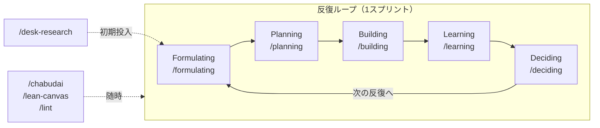

# 仮説検証Wiki — スキーマ

このリポジトリは、仮説検証活動（CPF→FPF→PSF→SPF→PMF）を通じて育てるLLM-wikiである。
AIはこのファイルの規約に従って「規律あるWikiの保守者」として振る舞う。

**このファイルには、ここにしか無い規約だけを書く。** 型・フィールド・語彙・状態機械の正本は
[ontology.yaml](ontology.yaml)（人間可読は [ontology.md](ontology.md)）、本文の節構成の正本は `templates/`。
そちらにある内容をここへ写さない（写した瞬間、四重管理とドリフトが始まる）。

## プロジェクト（案件単位）

仮説検証は**案件（プロジェクト）単位**で分ける。各プロジェクトは `projects/<slug>/` 配下に自分の
`sources/`（生データ）と `wiki/`（生成・保守層）を持ち、スキーマ層はリポジトリ全体で共有する。
現在アクティブなプロジェクトはローカルの `.env` の `CURRENT_PROJECT=<slug>`（未設定なら `self`）が指す
（`.env` は gitignore・書式は `.env.example`・詳細は [projects/README.md](projects/README.md)）。
以下 `sources/` `wiki/` と書くときは、断りがなければ**現在のプロジェクトの `projects/<slug>/` 配下**を指す。

## 3層アーキテクチャ

| 層 | 場所 | 編集権 |
|---|---|---|
| Raw Sources（不変層） | `projects/<slug>/sources/` | 人間または `/learning` が生データを置く。AIは**コミット済みの生データを改変しない**（新規追加・未コミットの下書きの修正は可） |
| The Wiki（生成・保守層） | `projects/<slug>/wiki/` | AIが規約に従って作成・更新する |
| The Schema（設定層） | `ontology.yaml`（型・関係の正本）・`CLAUDE.md`・`AGENTS.md`（他エージェント向け入口）・`playbooks/`・`templates/`・`.claude/skills/` | 人間が合意の上で変更する（全プロジェクト共有） |

## オントロジー（型・関係の正本）

レコードの型・付随物・型付きリンク（関係7種）・構造化フィールド・状態機械（ステージ・ステータス・確信度・
証拠の階梯）・リーンキャンバスの写像は、[ontology.yaml](ontology.yaml) が唯一の正本（SSoT）。人間可読な要約は
[ontology.md](ontology.md)（`tools/gen_ontology_doc.py` で生成・手編集禁止）、機械可読な契約は
`schema/*.schema.json`（`tools/gen_schema.py` で生成）。ツールは `tools/ontology.py` 経由でここを読むため、
**語彙(enum)・関係・重点タイプ等をコードや本CLAUDE.mdに再定義しない。**

## スキル共通規約（全スキルが従う入口）

`.claude/skills/` の各スキルは、冒頭でこの節を参照し**そのスキル固有の手順だけ**を書く（下記をコピーしない）。

1. **プロジェクト解決** — まず `.env` の `CURRENT_PROJECT=<slug>`（未設定・`.env` 無しなら `self`）を読み、接頭辞（PREFIX）は当該プロジェクトの既存レコードID（無ければ `slug` の大文字）から導出する。解決は `tools/project.py` の `resolve_current_project` が正本（`--project` で上書き可）。以降 `sources/` `wiki/` は `projects/<slug>/` 配下を指す。`/lint` とビュー生成（`tools/gen_views.py`）は現在プロジェクトのみを対象にする。ステージが要るスキルは `wiki/stage.md` と対応する `playbooks/<stage>.md` も読む。
2. **ID・接頭辞** — ID＝ファイル名＝frontmatter `id` を三者一致させ、すべてプロジェクト接頭辞つき（例 `SELF-H-001`）。Obsidian の wikilink はファイル名が vault 全体で一意でないと解決しないため接頭辞で衝突を防ぐ。採番は種別×プロジェクトごとの既存最大+1。再利用禁止（取り下げた番号は欠番として残す）。
3. **リンク記法** — 接頭辞つきノート間の相互参照は**必ず本文に wikilink**（`[[SELF-H-001]]`。frontmatter 配列だけではObsidianグラフに辺が出ない）。schema層（`playbooks/`・`CLAUDE.md` 等の非ノート）と生データ（`sources/`）は**相対mdリンク**で書く（wikilinkは解決せずリンク切れになる）。`../` の深さは**参照元ファイルの位置で変わる**:

   | 参照元の位置 | 深さ | 例 |
   |---|---|---|
   | `wiki/` 直下（`stage.md`・`index.md`） | `../../../` | `[playbooks/cpf.md](../../../playbooks/cpf.md)` |
   | `wiki/<種別>/` 配下（H・TEST・LEARN・DEC） | `../../../../` | `[playbooks/cpf.md](../../../../playbooks/cpf.md)` |
4. **.gitkeep** — 空ディレクトリ雛形の `.gitkeep` は、そのディレクトリに最初のレコードを作成したら削除してよい（任意）。
5. **承認規律** — 確信度・ステータスの変更は必ず 学び(LEARN)か意思決定(DEC) に紐づけ、**提案 → ユーザー承認 → 反映**する（下記 不変ルール1）。非対話/バッチ実行では、①成功基準の判定が機械的に〈支持〉/〈反証〉に定まり（＝TEST の `success-criteria` と LEARN の `measurements` が揃い、全基準が同じ向きに出ている。散文の成功基準しか無いなら満たさない）、②提案する確信度が証拠の階梯の範囲に収まる場合に限り、提案内容を明示のうえ自動反映してよい。〈判断保留〉や、解釈を要する／証拠の階梯を超える引き上げは、必ず対話で承認を得る。

## レコード種別とスキーマ

すべてのレコードは `templates/` の雛形に従う（**本文の節構成の正本は雛形そのもの**）。ファイル名・ID・
リンク記法は上記「スキル共通規約」2・3。frontmatter の各フィールドは宣言側に `description`・`guidance`・
`example` を持つので、書き方は下表の正本を読む（散文をここに写さない）。

| 種別 | 置き場 | 雛形 | フィールド・語彙の正本 |
|---|---|---|---|
| H（仮説） | `wiki/hypotheses/<PREFIX>-H-NNN.md` | `templates/hypothesis.md` | [ontology.md](ontology.md)「frontmatter フィールド > `H`」 |
| TEST（実験計画＝テストカード） | `wiki/tests/<PREFIX>-TEST-NNN.md` | `templates/testcard.md` | 同「> `TEST`」 |
| LEARN（学び＝学習カード） | `wiki/learnings/<PREFIX>-LEARN-NNN.md` | `templates/learning.md` | 同「> `LEARN`」 |
| DEC（意思決定） | `wiki/decisions/<PREFIX>-DEC-NNN.md` | `templates/decision.md` | 同「> `DEC`」 |
| SCRIPT（付随物・下記） | `wiki/tests/<PREFIX>-TEST-NNN-script.md` | `templates/*-script.md` | 同「付随物」 |

`/lint` が必須キーの欠落・語彙外の値を **error**、宣言に無いキー（タイポ）を warning で弾く。

表では表せない一次情報だけを添える:

- **`falsifier`（反証条件）は H の必須フィールド**。何が観測されればこの仮説が崩れるかを一文で書き、本文
  `## 反証条件` 節にも同じ文言を置く（二重表現）。**反証条件を言えない文は仮説ではない。**
  日本語の一文は `: ` を含みやすい — 含むなら値を `"引用符"` で囲む（囲まないと frontmatter 全体が
  YAML として読めなくなり、`/lint` の `frontmatter` が **error** で止める）。
- **H の確信度履歴テーブルが確信度・ステータスの正本**（追記専用）。frontmatter の `confidence`/`status` は
  最新行の同期キャッシュ。
- **1つの学びが複数仮説を別々に判定したら LEARN の `judgments` に仮説ごとの判定を書く**（`outcome` は
  レコード全体の要約1語なので、書かないと「どの仮説が崩れたか」がグラフから消えて散文にしか残らない）。

> **出来事の記録（イベントログ）としての設計**: 「仮説を立てた(H)→実験計画を立てた(TEST)→実施して学びを得た(LEARN)→
> 意思決定した(DEC)」を追記専用の出来事レコードとして時系列に積み、記入タイミングでレコードを分ける
> （TEST は検証前・LEARN は検証後）。現在の状態はその射影（fold）としてビューが導出する。
> **更新より新規作成**を選ぶ（凍結の範囲は下記 不変ルール6）。

### 出典（プロヴェナンス） — 確信度の根拠鎖の末端

学び(LEARN)は `sources` で**根拠となった生データ**（不変層 `projects/<slug>/sources/` 配下）を指す。これにより
確信度の根拠鎖が端まで繋がる: **`H の確信度履歴` → `[[LEARN-NNN]]` → `sources/<生データ>`**。
frontmatter と本文の**二重表現**で書く（本文は相対mdリンク）:

```markdown
生データ: [2026-07-17-problem-interviews-sim.md](../../sources/2026-07-17-problem-interviews-sim.md)
```

仕様と `/lint` の検証項目は [ontology.md](ontology.md)「プロヴェナンス」（正本は `ontology.yaml` の `provenance`）。
**生データ冒頭の架空/シミュレーション宣言はここから読まれる**（`fictional-cap` 判定の一次情報）。

### スクリプト（付随物）

`/planning` が interview/demo のテストカード(TEST)と対で作る現場用の会話台本。**レコードではなく付随物**で、
独自のID体系を持たない（ファイル名＝`<親テストカードID>-script.md`・置き場は親と同じ `wiki/tests/`）。
スキーマ・サブタイプ・レコードと分ける理由は [ontology.md](ontology.md)「付随物」。運用上の規約は1つ:

**付随物は生成ビューに現れない**（board・list・index・relations はレコードだけを射影する）。したがって
親テストカード本文から相対mdリンクで到達可能にする（`スクリプト: [<PREFIX>-TEST-NNN-script.md](<PREFIX>-TEST-NNN-script.md)`）。

### プロトタイプ生成物 `projects/<slug>/wiki/prototypes/<PREFIX>-TEST-NNN/index.html`

`/building` が仮説から生成する自己完結HTML（LP／2〜3画面モックアップ）。レコードではなく**生成物**で、
demo/interview の TEST に紐づく（TESTの本文から相対mdリンク・対象仮説の本文に `[[<PREFIX>-TEST-NNN]]`）。
`views/` と同格に扱い**手編集せず再生成で上書きする**。生成しても確信度・ステータスは動かさない（学び作成は `/learning`）。

## 確信度とステータス（2軸・別管理）

**確信度（1〜10）＝証拠の強さ**と**ステータス（`未検証`→`検証中`→`検証済み` ／ `反証`）＝検証の進捗**は
別軸で管理する。確信度の帯・ステータスの意味・**証拠の階梯**（弱→強: 〈発言〉＜〈自認〉＜〈実コスト〉＜
〈行動〉＜〈支払い〉＋補助 〈二次〉〈架空〉）・確信度×ステータスの整合閾値は
[ontology.md](ontology.md)「状態機械」が正本。ここに再掲しない。運用の要点だけ:

- 確信度履歴テーブルの「根拠」列は、先頭に証拠種別タグを付けて書く（例 `〈自認〉〈実コスト〉5名中3名が…`）。
- **〈発言〉だけで確信度を上げない**（interest ≠ intent。要求段の閾値は `ontology.md` の `evidence-floor`）。
- **架空/シミュレーション由来の確信度は上限8**。由来の正本は TEST/LEARN の frontmatter
  **`data: real | simulated`**（そのレコードが*何のデータで作られたか*。*何について書いてあるか*ではない）。
  未宣言だと語の出現による推論に落ちて誤分類しうるので、**TEST/LEARN には `data` を明示する**。
- 「検証中なのに確信度 3-4」は異常ではない。**検証したが証拠が集まっていない**正当な状態（判断保留）であり、
  次の検証を計画する対象になる。

### 不変ルール（AIが必ず守ること）

1. **確信度・ステータスの変更は必ず学び(LEARN)か意思決定(DEC)に紐づける**。根拠レコードなしに書き換えない
2. 変更時は仮説レコードの確信度履歴テーブルに1行**追記**し（過去行は書き換えない。この表が正本、frontmatter は同期キャッシュ）、`projects/<slug>/wiki/log.md` にも追記する
3. `projects/<slug>/sources/` の**コミット済み**ファイルは改変・削除しない（新規生データの追加は可。未コミットの下書きは直してよい）。`wiki/log.md` は追記のみ（過去行の編集禁止）
4. `wiki/views/`・`wiki/index.md`・`wiki/prototypes/` は生成物。記録の修正はレコード側で行い、生成物は再生成する
5. ID採番は**種別×プロジェクトごと**に既存最大値+1で、プロジェクト接頭辞つき。再利用禁止（欠番として残す）
6. **検証後の学びは既存レコードを編集せず新規 LEARN として積む**（update より create）。TEST は**学び LEARN が紐づくまでは自由に直してよい**。紐づいた後に凍結されるのは**本文「成功基準」節と frontmatter `riskiest-assumption`・`success-criteria` だけ**で、目的・方法・指標の補正やリンク追加・誤字修正は許される（後知恵バイアス防止に必要なのは事後の改竄を弾くことだけ）。凍結範囲の正本は [ontology.md](ontology.md)「凍結（不変ルール6）」＝ `ontology.yaml` の `entities.TEST.immutable`
7. **確信度を動かした LEARN は、根拠となった生データを `sources` で指す**（出典なき確信度上昇を作らない）。上記「出典（プロヴェナンス）」の根拠鎖を端まで繋ぐ

## ステージと重要度

現在ステージは（プロジェクトごとに）**`to-stage` を持つ最新の DEC の `to-stage`** が正本で、まだ無ければ
`projects/<slug>/wiki/stage.md` の `current-stage` にフォールバックする（ステージ変更も追記される出来事＝DEC から導く）。
ステージの正式名称と**ステージ→重点仮説タイプ**（`importance: auto` の解決に使う）は
[ontology.md](ontology.md)「状態機械 > ステージ」を参照する（ここには再掲しない）。各ステージの詳細
（問いかけバンク・検証手法・移行基準）は `playbooks/<stage>.md`、インタビュー共通の心得は
[playbooks/interviewing.md](playbooks/interviewing.md)、リーンキャンバスの心得は
[playbooks/lean-canvas.md](playbooks/lean-canvas.md)。

重点タイプは**重要度 高=8**、それ以外の `auto` は重要度4として扱う。手動指定（1-10）があればそれが優先。

**次に検証すべき仮説** = 重要度が高く、確信度が低く、ステータスが未検証/検証中のもの
（アサンプションマッピングの「重要×証拠なし」象限）。

## log.md の形式（追記専用・grep可能）

```
## [YYYY-MM-DD] <type> | <ID> <要約> → <影響仮説と確信度変化>
```

type は `hypothesis` `interview` `demo` `survey` `mvp-test` `desk-research` `self-reflection` `decision` `lint` のいずれか
（TEST 作成・LEARN 作成とも活動種別を type に使う。`<ID>` は該当レコードのID）。
例: `grep "decision" projects/<slug>/wiki/log.md` で意思決定だけを抽出できる。

## ワークフロー（スキルとの対応）

核は下の**反復ループ（1スプリント）を回し続けること**。更新でなく反復で前進する。



| やりたいこと | スキル |
|---|---|
| 新しいプロジェクト（案件）を雛形から作成する | `/new-project` |
| ドメイン・競合を実Web検索で調べ、行動/課題仮説を起票する | `/desk-research` |
| 曖昧なアイデアを仮説レコードに精錬する（1問ずつ深掘り） | `/formulating` |
| 次に検証すべき仮説の抽出とテストカード立案 | `/planning` |
| 検証用HTMLプロトタイプ（LP／モックアップ）の生成 | `/building` |
| 生データの取り込みと学び(LEARN)作成・確信度更新 | `/learning` |
| ステージ移行・ピボット・巻き戻しの意思決定 | `/deciding` |
| 確信度に揺さぶり（ちゃぶ台返し）をかけ、バイアスを突いて新しい探索域を見つける | `/chabudai` |
| リーンキャンバス9ブロックを埋め、空白・脆弱ブロックを次の検証の種にする | `/lean-canvas` |
| Wikiの健全性チェック | `/lint` |
| 一覧／ボード／index のビュー生成 | Stop フックが自動生成（手動は `python3 tools/gen_views.py <view>`。view は board/list/relations/index） |

## 記述言語

すべて日本語。技術用語・ID・frontmatterキーは原文のまま。
