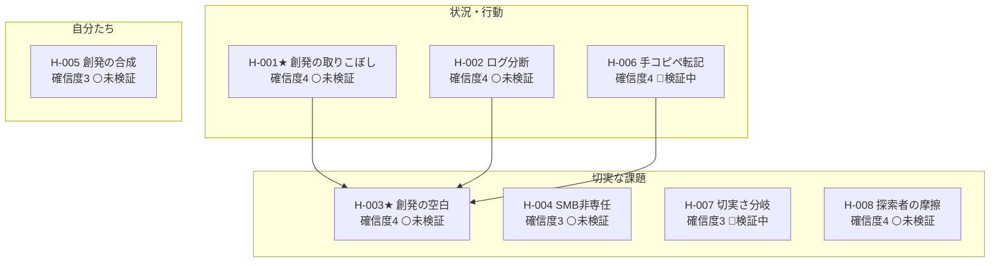

<!-- 生成物: gen_views.py list による機械生成。手編集禁止。`python3 tools/gen_views.py list` で再生成する。生成基準日: 2026-07-20（ステージ CPF） -->
<!-- ⚠️ 架空/シミュレーションデータを含む活動: [[AGP-ACT-002]] [[AGP-ACT-004]]。これら由来の確信度・判断は実データ未検証。 -->

# 全仮説リスト（agent-platform）

現在ステージ: **CPF**。重要度は CPF 重点タイプ=8・その他=4 で算出（frontmatter 射影）。★=核心仮説（`core`）。関連列は ← 派生元／→ 因果先（`leads-to`）／検証活動（ACT）。

## バリューチェーン（行動 → 切実な課題 → 解決策 → 市場）

## 状況・行動仮説

| ID | タイトル | 確信度 | ステータス | 重要度 | 関連 | 直近の根拠 |
|---|---|---|---|---|---|---|
| [[AGP-H-001]]★ | 不確実な取り組みでは試行錯誤から創発する方向を取り出せない | 4 | ⚪未検証 | 8 | → [[AGP-H-003]] ・ [[AGP-ACT-001]] [[AGP-ACT-002]] [[AGP-ACT-004]] [[AGP-ACT-005]] | 〈二次〉デスクリサーチv2で新テーマへ再ベースライン。effectuation/DDP/… |
| [[AGP-H-002]] | AI導入担当は複数エージェントのログを一元的に分析できていない | 4 | ⚪未検証 | 8 | → [[AGP-H-003]] ・ [[AGP-ACT-001]] | 〈二次〉AMP（agent management platform）が新カテゴリ化＝運用… |
| [[AGP-H-006]] | チームは会話の知見を手作業でwikiに転記するが陳腐化する | 4 | 🔄検証中 | 8 | → [[AGP-H-003]] ・ [[AGP-ACT-002]] | 〈架空〉〈行動〉問題IV 2名（P-A/P-B）が手作業転記の陳腐化を具体的に語る。n少… |

## 課題仮説

| ID | タイトル | 確信度 | ステータス | 重要度 | 関連 | 直近の根拠 |
|---|---|---|---|---|---|---|
| [[AGP-H-003]]★ | ビジョン先行は脆く純粋な試行錯誤は迷走する——中間を支える術がない | 4 | ⚪未検証 | 8 | ← [[AGP-H-001]] ・ [[AGP-ACT-001]] [[AGP-ACT-002]] [[AGP-ACT-003]] [[AGP-ACT-004]] [[AGP-ACT-005]] | 〈二次〉デスクリサーチv2で新テーマへ再ベースライン。中間の空白＋ステージゲートcate… |
| [[AGP-H-008]] | 社内探索組織はビジョン先行の統治と創発的現実の摩擦で疲弊する | 4 | ⚪未検証 | 8 | ← [[AGP-H-003]] ・ [[AGP-ACT-005]] | 〈二次〉2026査読（イントレのアイデンティティ困難）＋ステージゲートの categor… |
| [[AGP-H-004]] | 中小企業は非専任ゆえエージェントのログ分析が回らない | 3 | ⚪未検証 | 8 | [[AGP-ACT-001]] | 〈二次〉状況証拠が弱く単一寄り。SMB非専任は一次で実コストを要確認 |
| [[AGP-H-007]] | ナレッジ断絶の切実さは役割・監査有無でセグメント依存 | 3 | 🔄検証中 | 8 | ← [[AGP-H-003]] | 〈架空〉問題IVで支持3名と反証3名が役割で分岐。事後創発（事前登録なし）のため確信度は… |

## 自分たち仮説

| ID | タイトル | 確信度 | ステータス | 重要度 | 関連 | 直近の根拠 |
|---|---|---|---|---|---|---|
| [[AGP-H-005]] | AIが試行錯誤から創発する方向を随時合成する（仮説検証の一般化） | 3 | ⚪未検証 | 4 | [[AGP-ACT-001]] [[AGP-ACT-003]] [[AGP-ACT-005]] | 〈二次〉仮説検証の一般化という空白は当たりのみ。Lean/OKR/ノートAIが近接。一次… |

## 次に検証すべき仮説（重要度8 × 確信度低 × 未検証/検証中）

- [[AGP-H-004]] 中小企業は非専任ゆえエージェントのログ分析が回らない（確信度3・未検証）
- [[AGP-H-007]] ナレッジ断絶の切実さは役割・監査有無でセグメント依存（確信度3・検証中）
- [[AGP-H-001]] 不確実な取り組みでは試行錯誤から創発する方向を取り出せない（確信度4・未検証）
- [[AGP-H-002]] AI導入担当は複数エージェントのログを一元的に分析できていない（確信度4・未検証）
- [[AGP-H-003]] ビジョン先行は脆く純粋な試行錯誤は迷走する——中間を支える術がない（確信度4・未検証）
- [[AGP-H-006]] チームは会話の知見を手作業でwikiに転記するが陳腐化する（確信度4・検証中）
- [[AGP-H-008]] 社内探索組織はビジョン先行の統治と創発的現実の摩擦で疲弊する（確信度4・未検証）

## タイプ別サマリ

| タイプ | 件数 | 検証済み | 検証中 | 未検証 | 反証 |
|---|---|---|---|---|---|
| 状況・行動仮説 | 3 | 0 | 1 | 2 | 0 |
| 課題仮説 | 4 | 0 | 1 | 3 | 0 |
| 自分たち仮説 | 1 | 0 | 0 | 1 | 0 |
