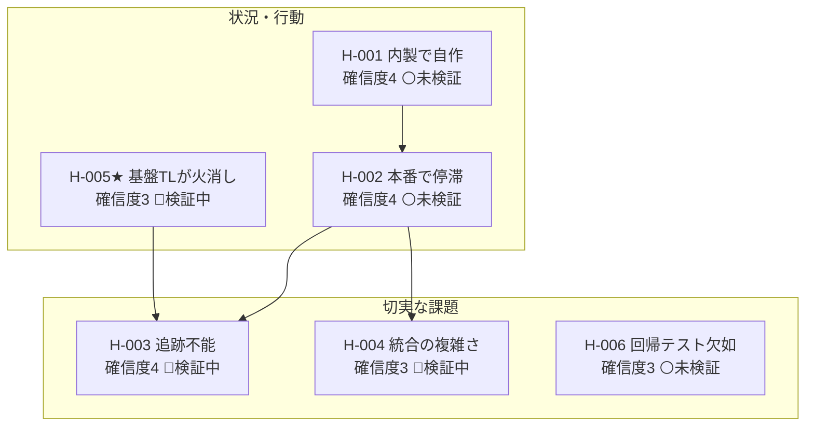

<!-- 生成物: gen_views.py list による機械生成。手編集禁止。`python3 tools/gen_views.py list` で再生成する。生成基準日: 2026-07-26（ステージ CPF） -->
<!-- ⚠️ 架空/シミュレーションデータを含む活動: [[AGP-LEARN-002]] [[AGP-LEARN-003]]。これら由来の確信度・判断は実データ未検証。 -->

# 全仮説リスト（agent-platform）

現在ステージ: **CPF**。重要度は CPF 重点タイプ=8・その他=4 で算出（frontmatter 射影）。★=核心仮説（`core`）。関連列は ← 派生元／→ 因果先（`leads-to`）／検証活動 TEST・学び LEARN。

## バリューチェーン（行動 → 切実な課題 → 解決策 → 市場）

```mermaid
flowchart TB
    subgraph beh["状況・行動"]
      AGP_H_001["H-001 内製で自作<br/>確信度4 ⚪未検証"]
      AGP_H_002["H-002 本番で停滞<br/>確信度4 ⚪未検証"]
      AGP_H_005["H-005★ 基盤TLが火消し<br/>確信度3 🔄検証中"]
    end
    subgraph prob["切実な課題"]
      AGP_H_003["H-003 追跡不能<br/>確信度4 🔄検証中"]
      AGP_H_004["H-004 統合の複雑さ<br/>確信度3 🔄検証中"]
      AGP_H_006["H-006 回帰テスト欠如<br/>確信度3 ⚪未検証"]
    end
    AGP_H_001 --> AGP_H_002
    AGP_H_002 --> AGP_H_003
    AGP_H_002 --> AGP_H_004
    AGP_H_005 --> AGP_H_003
```

## 状況・行動仮説

| ID | タイトル | 確信度 | ステータス | 重要度 | 関連 | 直近の根拠 |
|---|---|---|---|---|---|---|
| [[AGP-H-001]] | 内製チームがOSSフレームワークでAIエージェントを自作している | 4 | ⚪未検証 | 8 | → [[AGP-H-002]] ・ [[AGP-LEARN-001]] [[AGP-LEARN-003]] | 〈二次〉OSSは自由度が高い一方で統合・保守が社内エンジニアに移る、と複数出典が指摘。C… |
| [[AGP-H-002]] | PoCは作れても本番投入の運用段階で停滞する | 4 | ⚪未検証 | 8 | ← [[AGP-H-001]] ・ → [[AGP-H-003]] [[AGP-H-004]] ・ [[AGP-LEARN-001]] [[AGP-LEARN-003]] | 〈二次〉「78%がパイロット・本番化は14%」「most teams stall at … |
| [[AGP-H-005]]★ | 基盤チームのTLが散在エージェントの火消しを横断で背負っている | 3 | 🔄検証中 | 8 | ← [[AGP-H-001]] ・ → [[AGP-H-003]] ・ [[AGP-LEARN-002]] [[AGP-LEARN-003]] [[AGP-TEST-001]] | 〈架空〉揺さぶり監査で是正（実在裏取りゼロ・前提が一部否定＝P4。背骨だが架空由来6→創… |

## 課題仮説

| ID | タイトル | 確信度 | ステータス | 重要度 | 関連 | 直近の根拠 |
|---|---|---|---|---|---|---|
| [[AGP-H-003]] | 本番でエージェントの挙動を追跡できずサイレント失敗に困る | 4 | 🔄検証中 | 8 | ← [[AGP-H-002]] ・ [[AGP-LEARN-001]] [[AGP-LEARN-002]] [[AGP-LEARN-003]] [[AGP-TEST-001]] [[AGP-TEST-002]] | 〈架空〉揺さぶり監査で水増しを是正（架空由来6→実証拠なし・二次水準4へ減点） |
| [[AGP-H-004]] | ツール毎のカスタムコネクタ実装と保守に疲弊している | 3 | 🔄検証中 | 8 | ← [[AGP-H-002]] ・ [[AGP-LEARN-001]] [[AGP-LEARN-002]] [[AGP-LEARN-003]] [[AGP-TEST-001]] [[AGP-TEST-002]] | 〈架空〉統合の実コストは架空5名中2名のみ・標準層(MCP等)で賄う声→切実さ想定より弱… |
| [[AGP-H-006]] | デプロイ前の回帰/評価テストが無く恐る恐る更新している | 3 | ⚪未検証 | 8 | ← [[AGP-H-002]] ・ [[AGP-LEARN-002]] | 〈架空〉問題インタビュー（架空5名）中、複数が「回帰テストが無く恐る恐るデプロイ」と言及… |

## 次に検証すべき仮説（重要度8 × 確信度低 × 未検証/検証中）

- [[AGP-H-004]] ツール毎のカスタムコネクタ実装と保守に疲弊している（確信度3・検証中）
- [[AGP-H-005]] 基盤チームのTLが散在エージェントの火消しを横断で背負っている（確信度3・検証中）
- [[AGP-H-006]] デプロイ前の回帰/評価テストが無く恐る恐る更新している（確信度3・未検証）
- [[AGP-H-001]] 内製チームがOSSフレームワークでAIエージェントを自作している（確信度4・未検証）
- [[AGP-H-002]] PoCは作れても本番投入の運用段階で停滞する（確信度4・未検証）
- [[AGP-H-003]] 本番でエージェントの挙動を追跡できずサイレント失敗に困る（確信度4・検証中）

## タイプ別サマリ

| タイプ | 件数 | 検証済み | 検証中 | 未検証 | 反証 |
|---|---|---|---|---|---|
| 状況・行動仮説 | 3 | 0 | 1 | 2 | 0 |
| 課題仮説 | 3 | 0 | 2 | 1 | 0 |
