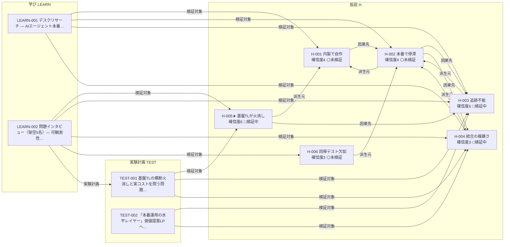

<!-- 生成物: gen_views.py relations による機械生成。手編集禁止。`python3 tools/gen_views.py relations` で再生成する。生成基準日: 2026-07-26（ステージ CPF） -->
<!-- ⚠️ 架空/シミュレーションデータを含む活動: [[AGP-LEARN-002]]。これら由来の確信度・判断は実データ未検証。 -->

# 関係グラフ（agent-platform）

レコード間の型付きリンク（オントロジーの関係）を frontmatter から射影する。ノード=レコード、矢印=関係（ラベル=関係名）。関係の定義は [ontology.md](../../../../ontology.md) を参照。

## 型付き関係グラフ

## 関係インデックス

### 派生元（`derived-from`: H→H）

| 始点 | 関係 | 終点 |
|---|---|---|
| [[AGP-H-002]] | 派生元 → | [[AGP-H-001]] |
| [[AGP-H-003]] | 派生元 → | [[AGP-H-002]] |
| [[AGP-H-004]] | 派生元 → | [[AGP-H-002]] |
| [[AGP-H-005]] | 派生元 → | [[AGP-H-001]] |
| [[AGP-H-006]] | 派生元 → | [[AGP-H-002]] |

### 因果先（`leads-to`: H→H）

| 始点 | 関係 | 終点 |
|---|---|---|
| [[AGP-H-001]] | 因果先 → | [[AGP-H-002]] |
| [[AGP-H-002]] | 因果先 → | [[AGP-H-003]] |
| [[AGP-H-002]] | 因果先 → | [[AGP-H-004]] |
| [[AGP-H-005]] | 因果先 → | [[AGP-H-003]] |

### 対応課題（`addresses`: H→H）

（該当なし）

### 検証対象（`hypotheses`: LEARN/TEST→H）

| 始点 | 関係 | 終点 |
|---|---|---|
| [[AGP-TEST-001]] | 検証対象 → | [[AGP-H-005]] |
| [[AGP-TEST-001]] | 検証対象 → | [[AGP-H-003]] |
| [[AGP-TEST-001]] | 検証対象 → | [[AGP-H-004]] |
| [[AGP-TEST-002]] | 検証対象 → | [[AGP-H-003]] |
| [[AGP-TEST-002]] | 検証対象 → | [[AGP-H-004]] |
| [[AGP-LEARN-001]] | 検証対象 → | [[AGP-H-001]] |
| [[AGP-LEARN-001]] | 検証対象 → | [[AGP-H-002]] |
| [[AGP-LEARN-001]] | 検証対象 → | [[AGP-H-003]] |
| [[AGP-LEARN-001]] | 検証対象 → | [[AGP-H-004]] |
| [[AGP-LEARN-002]] | 検証対象 → | [[AGP-H-005]] |
| [[AGP-LEARN-002]] | 検証対象 → | [[AGP-H-003]] |
| [[AGP-LEARN-002]] | 検証対象 → | [[AGP-H-004]] |
| [[AGP-LEARN-002]] | 検証対象 → | [[AGP-H-006]] |

### 実験計画（`learns-from`: LEARN→TEST）

| 始点 | 関係 | 終点 |
|---|---|---|
| [[AGP-LEARN-002]] | 実験計画 → | [[AGP-TEST-001]] |

### 根拠活動（`based-on`: DEC→LEARN/TEST）

（該当なし）

## バックリンク索引（誰から・どの関係で参照されているか）

- [[AGP-H-001]] ← 派生先: [[AGP-H-002]] [[AGP-H-005]] ／ 検証活動: [[AGP-LEARN-001]]
- [[AGP-H-002]] ← 因果元: [[AGP-H-001]] ／ 派生先: [[AGP-H-003]] [[AGP-H-004]] [[AGP-H-006]] ／ 検証活動: [[AGP-LEARN-001]]
- [[AGP-H-003]] ← 因果元: [[AGP-H-002]] [[AGP-H-005]] ／ 検証活動: [[AGP-TEST-001]] [[AGP-TEST-002]] [[AGP-LEARN-001]] [[AGP-LEARN-002]]
- [[AGP-H-004]] ← 因果元: [[AGP-H-002]] ／ 検証活動: [[AGP-TEST-001]] [[AGP-TEST-002]] [[AGP-LEARN-001]] [[AGP-LEARN-002]]
- [[AGP-H-005]] ← 検証活動: [[AGP-TEST-001]] [[AGP-LEARN-002]]
- [[AGP-H-006]] ← 検証活動: [[AGP-LEARN-002]]
- [[AGP-TEST-001]] ← 学び: [[AGP-LEARN-002]]
