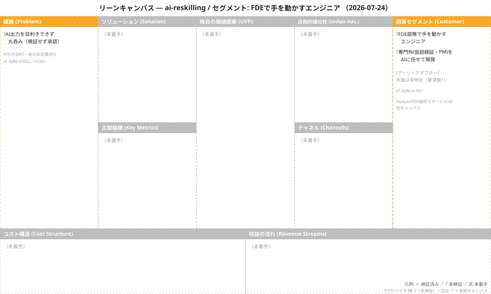

<!-- 生成物: gen_views.py index による機械生成。手編集禁止。`python3 tools/gen_views.py index` で再生成する。生成基準日: 2026-07-31（ステージ CPF） / ontology-version: 1 -->

# ai-reskilling — 仮説インデックス

全仮説の現在の確信度・ステータス（レコードからの射影）。詳細は [board](views/board.md)・[list](views/hypotheses-list.md)・[relations](views/relations.md) 各ビューを参照。

- ステージ: **CPF** Customer Problem Fit
- 仮説(H) 3 ｜ 実験計画(TEST) 2 ｜ 学び(LEARN) 2 ｜ 意思決定(DEC) 0

## リーンキャンバス

[原寸で開く](lean-canvas/AIRE-lean-canvas-2026-07-24.svg) ｜ 2026-07-24 時点 ｜ `/lean-canvas` の生成物（レコードではない）

## 仮説一覧

| 仮説 | タイトル | 確信度 | ステータス | 重要度 |
|---|---|---|---|---|
| [[AIRE-H-002]] | 理解せぬ承認の反復で成果物が累積的に歪む | 3 | 未検証 | 8 |
| [[AIRE-H-003]] | 中核は実行でなく目利きとオーケストレーションだが不足しがち | 3 | 未検証 | 8 |
| [[AIRE-H-001]] | 専門外はエージェントに丸投げし検証せず承認して進める | 4 | 未検証 | 8 |
