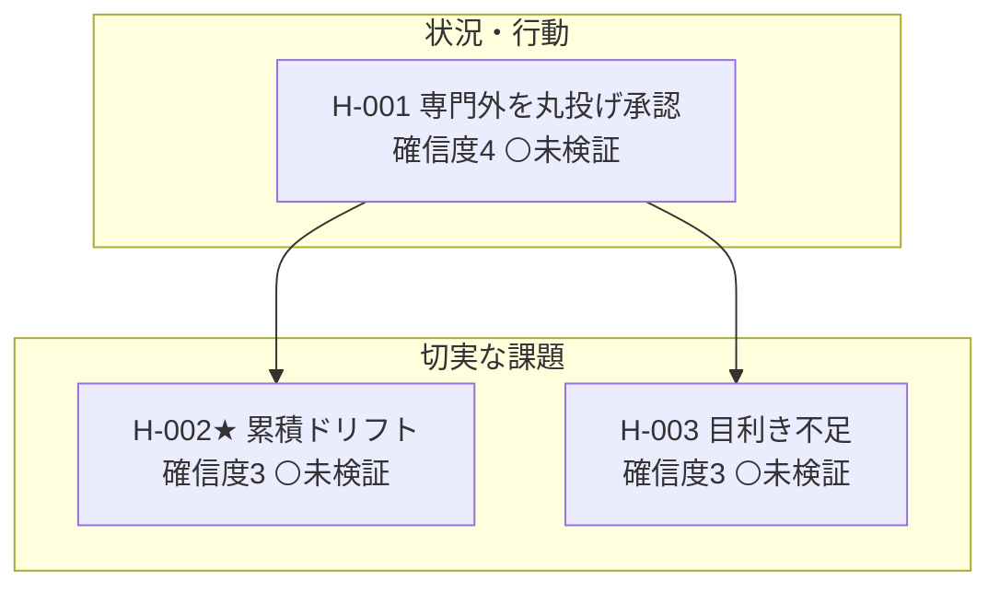

<!-- 生成物: gen_views.py list による機械生成。手編集禁止。`python3 tools/gen_views.py list` で再生成する。生成基準日: 2026-07-21（ステージ CPF） -->
<!-- ⚠️ 架空/シミュレーションデータを含む活動: [[AIRE-ACT-004]]。これら由来の確信度・判断は実データ未検証。 -->

# 全仮説リスト（ai-reskilling）

現在ステージ: **CPF**。重要度は CPF 重点タイプ=8・その他=4 で算出（frontmatter 射影）。★=核心仮説（`core`）。関連列は ← 派生元／→ 因果先（`leads-to`）／検証活動（ACT）。

## バリューチェーン（行動 → 切実な課題 → 解決策 → 市場）

## 状況・行動仮説

| ID | タイトル | 確信度 | ステータス | 重要度 | 関連 | 直近の根拠 |
|---|---|---|---|---|---|---|
| [[AIRE-H-001]] | 専門外はエージェントに丸投げし検証せず承認して進める | 4 | ⚪未検証 | 8 | → [[AIRE-H-002]] [[AIRE-H-003]] ・ [[AIRE-ACT-001]] [[AIRE-ACT-002]] [[AIRE-ACT-003]] [[AIRE-ACT-004]] | 〈二次〉揺さぶり監査で据え置き（反証耐性確認）。根拠が一般集団の観測で的集団「2名＋専門… |

## 課題仮説

| ID | タイトル | 確信度 | ステータス | 重要度 | 関連 | 直近の根拠 |
|---|---|---|---|---|---|---|
| [[AIRE-H-002]]★ | 理解せぬ承認の反復で成果物が累積的に歪む | 3 | ⚪未検証 | 8 | [[AIRE-ACT-001]] [[AIRE-ACT-002]] [[AIRE-ACT-003]] [[AIRE-ACT-004]] | 〈二次〉揺さぶり監査で引き下げ。核「累積的に歪む」は未観測の因果推論で、支えるP6が意見… |
| [[AIRE-H-003]] | 中核は実行でなく目利きとオーケストレーションだが不足しがち | 3 | ⚪未検証 | 8 | [[AIRE-ACT-001]] [[AIRE-ACT-002]] [[AIRE-ACT-003]] [[AIRE-ACT-004]] | 〈二次〉揺さぶり監査で据え置き（反証耐性確認）。既に最低確信度で崩れない。(a)中核性〈… |

## 次に検証すべき仮説（重要度8 × 確信度低 × 未検証/検証中）

- [[AIRE-H-002]] 理解せぬ承認の反復で成果物が累積的に歪む（確信度3・未検証）
- [[AIRE-H-003]] 中核は実行でなく目利きとオーケストレーションだが不足しがち（確信度3・未検証）
- [[AIRE-H-001]] 専門外はエージェントに丸投げし検証せず承認して進める（確信度4・未検証）

## タイプ別サマリ

| タイプ | 件数 | 検証済み | 検証中 | 未検証 | 反証 |
|---|---|---|---|---|---|
| 状況・行動仮説 | 1 | 0 | 0 | 1 | 0 |
| 課題仮説 | 2 | 0 | 0 | 2 | 0 |
