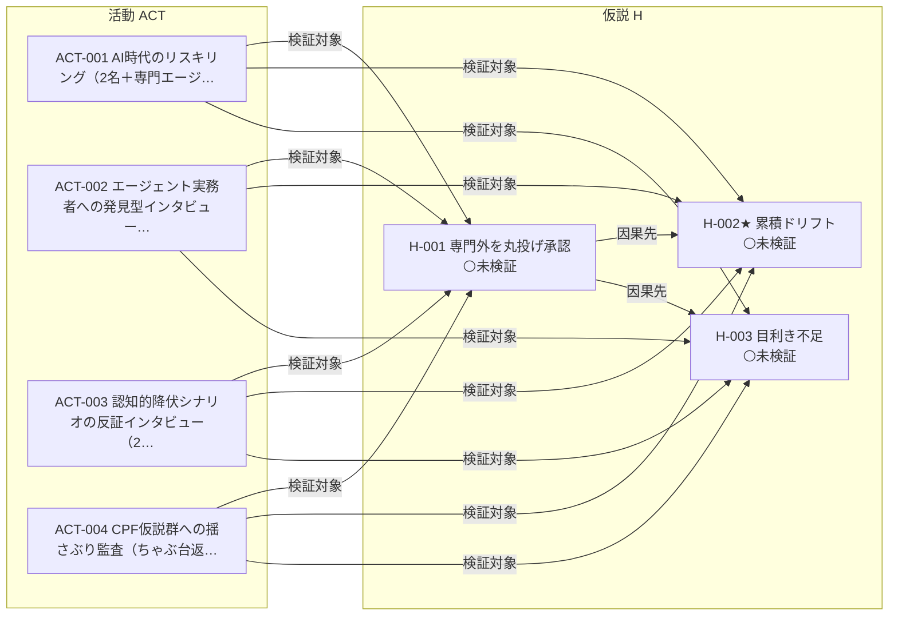

<!-- 生成物: gen_views.py relations による機械生成。手編集禁止。`python3 tools/gen_views.py relations` で再生成する。生成基準日: 2026-07-21（ステージ CPF） -->
<!-- ⚠️ 架空/シミュレーションデータを含む活動: [[AIRE-ACT-004]]。これら由来の確信度・判断は実データ未検証。 -->

# 関係グラフ（ai-reskilling）

レコード間の型付きリンク（オントロジーの関係）を frontmatter から射影する。ノード=レコード、矢印=関係（ラベル=関係名）。関係の定義は [ontology.md](../../../../ontology.md) を参照。

## 型付き関係グラフ

## 関係インデックス

### 因果先（`leads-to`: H→H）

| 始点 | 関係 | 終点 |
|---|---|---|
| [[AIRE-H-001]] | 因果先 → | [[AIRE-H-002]] |
| [[AIRE-H-001]] | 因果先 → | [[AIRE-H-003]] |

### 検証対象（`hypotheses`: ACT→H）

| 始点 | 関係 | 終点 |
|---|---|---|
| [[AIRE-ACT-001]] | 検証対象 → | [[AIRE-H-001]] |
| [[AIRE-ACT-001]] | 検証対象 → | [[AIRE-H-002]] |
| [[AIRE-ACT-001]] | 検証対象 → | [[AIRE-H-003]] |
| [[AIRE-ACT-002]] | 検証対象 → | [[AIRE-H-001]] |
| [[AIRE-ACT-002]] | 検証対象 → | [[AIRE-H-002]] |
| [[AIRE-ACT-002]] | 検証対象 → | [[AIRE-H-003]] |
| [[AIRE-ACT-003]] | 検証対象 → | [[AIRE-H-001]] |
| [[AIRE-ACT-003]] | 検証対象 → | [[AIRE-H-002]] |
| [[AIRE-ACT-003]] | 検証対象 → | [[AIRE-H-003]] |
| [[AIRE-ACT-004]] | 検証対象 → | [[AIRE-H-001]] |
| [[AIRE-ACT-004]] | 検証対象 → | [[AIRE-H-002]] |
| [[AIRE-ACT-004]] | 検証対象 → | [[AIRE-H-003]] |

## バックリンク索引（誰から・どの関係で参照されているか）

- [[AIRE-H-001]] ← 検証活動: [[AIRE-ACT-001]] [[AIRE-ACT-002]] [[AIRE-ACT-003]] [[AIRE-ACT-004]]
- [[AIRE-H-002]] ← 因果元: [[AIRE-H-001]] ／ 検証活動: [[AIRE-ACT-001]] [[AIRE-ACT-002]] [[AIRE-ACT-003]] [[AIRE-ACT-004]]
- [[AIRE-H-003]] ← 因果元: [[AIRE-H-001]] ／ 検証活動: [[AIRE-ACT-001]] [[AIRE-ACT-002]] [[AIRE-ACT-003]] [[AIRE-ACT-004]]
