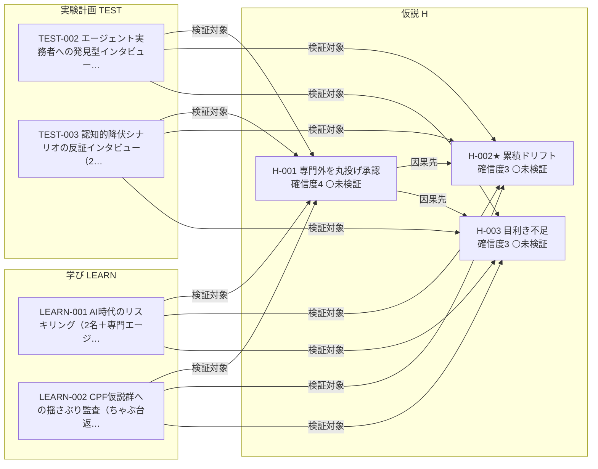

<!-- 生成物: gen_views.py relations による機械生成。手編集禁止。`python3 tools/gen_views.py relations` で再生成する。生成基準日: 2026-08-01（ステージ CPF） / ontology-version: 1 -->

# 関係グラフ（ai-reskilling）

レコード間の型付きリンク（オントロジーの関係）を frontmatter から射影する。ノード=レコード、矢印=関係（ラベル=関係名）。関係の定義は [ontology.md](../../../../ontology.md) を参照。

## 型付き関係グラフ

```mermaid
flowchart LR
    subgraph H["仮説 H"]
      AIRE_H_001["H-001 専門外を丸投げ承認<br/>確信度4 ⚪未検証"]
      AIRE_H_002["H-002★ 累積ドリフト<br/>確信度3 ⚪未検証"]
      AIRE_H_003["H-003 目利き不足<br/>確信度3 ⚪未検証"]
    end
    subgraph TEST["実験計画 TEST"]
      AIRE_TEST_002["TEST-002 エージェント実務者への発見型インタビュー…"]
      AIRE_TEST_003["TEST-003 認知的降伏シナリオの反証インタビュー（2…"]
    end
    subgraph LEARN["学び LEARN"]
      AIRE_LEARN_001["LEARN-001 AI時代のリスキリング（2名＋専門エージ…"]
      AIRE_LEARN_002["LEARN-002 CPF仮説群への揺さぶり監査（ちゃぶ台返…"]
    end
    AIRE_H_001 -->|因果先| AIRE_H_002
    AIRE_H_001 -->|因果先| AIRE_H_003
    AIRE_TEST_002 -->|検証対象| AIRE_H_001
    AIRE_TEST_002 -->|検証対象| AIRE_H_002
    AIRE_TEST_002 -->|検証対象| AIRE_H_003
    AIRE_TEST_003 -->|検証対象| AIRE_H_001
    AIRE_TEST_003 -->|検証対象| AIRE_H_002
    AIRE_TEST_003 -->|検証対象| AIRE_H_003
    AIRE_LEARN_001 -->|検証対象| AIRE_H_001
    AIRE_LEARN_001 -->|検証対象| AIRE_H_002
    AIRE_LEARN_001 -->|検証対象| AIRE_H_003
    AIRE_LEARN_002 -->|検証対象| AIRE_H_001
    AIRE_LEARN_002 -->|検証対象| AIRE_H_002
    AIRE_LEARN_002 -->|検証対象| AIRE_H_003
```

## 関係インデックス

### 派生元（`derived-from`: H→H）

（該当なし）

### 因果先（`leads-to`: H→H）

| 始点 | 関係 | 終点 |
|---|---|---|
| [[AIRE-H-001]] | 因果先 → | [[AIRE-H-002]] |
| [[AIRE-H-001]] | 因果先 → | [[AIRE-H-003]] |

### 対応課題（`addresses`: H→H）

（該当なし）

### 検証対象（`hypotheses`: LEARN/TEST→H）

| 始点 | 関係 | 終点 |
|---|---|---|
| [[AIRE-TEST-002]] | 検証対象 → | [[AIRE-H-001]] |
| [[AIRE-TEST-002]] | 検証対象 → | [[AIRE-H-002]] |
| [[AIRE-TEST-002]] | 検証対象 → | [[AIRE-H-003]] |
| [[AIRE-TEST-003]] | 検証対象 → | [[AIRE-H-001]] |
| [[AIRE-TEST-003]] | 検証対象 → | [[AIRE-H-002]] |
| [[AIRE-TEST-003]] | 検証対象 → | [[AIRE-H-003]] |
| [[AIRE-LEARN-001]] | 検証対象 → | [[AIRE-H-001]] |
| [[AIRE-LEARN-001]] | 検証対象 → | [[AIRE-H-002]] |
| [[AIRE-LEARN-001]] | 検証対象 → | [[AIRE-H-003]] |
| [[AIRE-LEARN-002]] | 検証対象 → | [[AIRE-H-001]] |
| [[AIRE-LEARN-002]] | 検証対象 → | [[AIRE-H-002]] |
| [[AIRE-LEARN-002]] | 検証対象 → | [[AIRE-H-003]] |

### 実験計画（`learns-from`: LEARN→TEST）

（該当なし）

### 根拠活動（`based-on`: DEC→LEARN/TEST）

（該当なし）

## バックリンク索引（誰から・どの関係で参照されているか）

- [[AIRE-H-001]] ← 検証活動: [[AIRE-TEST-002]] [[AIRE-TEST-003]] [[AIRE-LEARN-001]] [[AIRE-LEARN-002]]
- [[AIRE-H-002]] ← 因果元: [[AIRE-H-001]] ／ 検証活動: [[AIRE-TEST-002]] [[AIRE-TEST-003]] [[AIRE-LEARN-001]] [[AIRE-LEARN-002]]
- [[AIRE-H-003]] ← 因果元: [[AIRE-H-001]] ／ 検証活動: [[AIRE-TEST-002]] [[AIRE-TEST-003]] [[AIRE-LEARN-001]] [[AIRE-LEARN-002]]

## グラフ診断

グラフ全体の欠落・偏りを機械算出する（個別の辺の型検証は `/lint` の担当）。

- **規模**: ノード 7 ／ 辺 14 ／ **辺÷ノード = 2.00**（健全な中間域）
- **連結成分**: 1（最大成分 7 ノード）。単一成分＝全レコードが関係で繋がっている
- **孤立仮説**（どの関係も持たない）: なし
- **ハブ**（次数上位＝コーパスを束ねているレコード）: [[AIRE-H-001]](6) [[AIRE-H-002]](5) [[AIRE-H-003]](5) [[AIRE-LEARN-001]](3) [[AIRE-LEARN-002]](3)
- **下流依存度**（`leads-to` の推移閉包＝崩れると波及が大きい背骨）: [[AIRE-H-001]](2)
- **未取り込みの生データ**（どの学びの `sources` からも参照されていない）: なし
