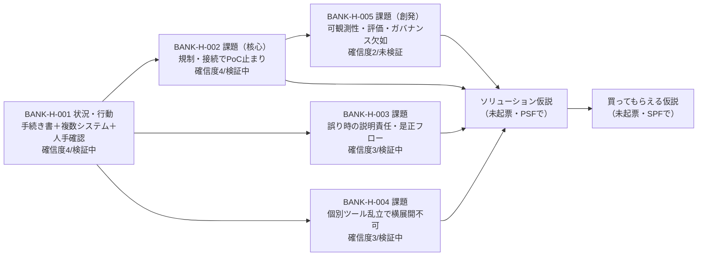

<!-- 生成物。手編集禁止。/view で再生成する。 -->
# 全仮説一覧（bank-agent）

> ⚠️ 確信度の根拠はすべて**二次情報（WebSearch言説）**。一次インタビュー未実施のため上限4。実データ未検証。

## バリューチェーン（行動→課題→解決策→買ってもらえる）

## 次に検証すべき仮説（重要度高 × 確信度低 × 未検証/検証中）

| 順 | ID | タイトル | タイプ | 確信度 | ステータス | 重要度 | 派生元 | 関連リンク |
|---|---|---|---|---|---|---|---|---|
| 1 | [[BANK-H-005]] | 可観測性・評価・ガバナンス欠如で本番移行できない | 課題 | 2 | 未検証 | 8 | [[BANK-H-002]] | [[BANK-ACT-002]] |
| 2 | [[BANK-H-003]] | 誤り時の説明責任・是正フロー未設計 | 課題 | 3 | 検証中 | 8 | [[BANK-H-001]] | [[BANK-ACT-002]] |
| 3 | [[BANK-H-004]] | 個別ツール乱立で横展開不可 | 課題 | 3 | 検証中 | 8 | [[BANK-H-001]] | [[BANK-ACT-002]] |
| 4 | [[BANK-H-002]] | 規制・接続でPoC止まり（★核心） | 課題 | 4 | 検証中 | 8 | [[BANK-H-001]] | [[BANK-ACT-002]] |
| 5 | [[BANK-H-001]] | 手続き書＋複数システム＋人手確認 | 状況・行動 | 4 | 検証中 | 8 | — | [[BANK-ACT-001]] |

いずれも二次情報止まり。次段階は一次インタビューで〈自認〉〈実コスト〉を取り、確信度5以上を狙う。

## 全仮説

| ID | タイトル | タイプ | 確信度 | ステータス | ステージ | 重要度 | 派生元 | 関連リンク |
|---|---|---|---|---|---|---|---|---|
| [[BANK-H-001]] | 手続き書＋複数システム＋人手ダブルチェックで処理 | 状況・行動仮説 | 4 | 検証中 | CPF | 8 | — | [[BANK-ACT-001]] |
| [[BANK-H-002]] | 規制対応・接続の壁でAIがPoC止まり（★核心候補） | 課題仮説 | 4 | 検証中 | CPF | 8 | [[BANK-H-001]] | [[BANK-ACT-002]] [[BANK-H-005]] |
| [[BANK-H-003]] | 誤り時の説明責任・是正フロー未設計 | 課題仮説 | 3 | 検証中 | CPF | 8 | [[BANK-H-001]] | [[BANK-ACT-002]] |
| [[BANK-H-004]] | 個別AIツール乱立で横展開できずコスト分散 | 課題仮説 | 3 | 検証中 | CPF | 8 | [[BANK-H-001]] | [[BANK-ACT-002]] |
| [[BANK-H-005]] | 可観測性・評価・ガバナンス欠如で本番移行できない（創発） | 課題仮説 | 2 | 未検証 | CPF | 8 | [[BANK-H-002]] | [[BANK-ACT-002]] |
