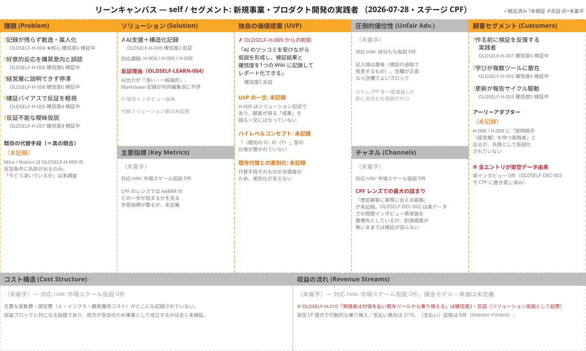

<!-- 生成物: gen_views.py index による機械生成。手編集禁止。`python3 tools/gen_views.py index` で再生成する。生成基準日: 2026-08-02（ステージ CPF） / ontology-version: 2 -->
<!-- ⚠️ 架空/シミュレーションデータを含む活動: [[OLDSELF-LEARN-002]] [[OLDSELF-LEARN-003]] [[OLDSELF-LEARN-004]] [[OLDSELF-LEARN-006]] [[OLDSELF-TEST-002]] [[OLDSELF-TEST-003]] [[OLDSELF-TEST-004]]。これら由来の確信度・判断は実データ未検証。 -->

# oldself — 仮説インデックス

全仮説の現在の確信度・ステータス（レコードからの射影）。詳細は [board](views/board.md)・[list](views/hypotheses-list.md)・[relations](views/relations.md) 各ビューを参照。

- ステージ: **CPF** Customer Problem Fit
- 仮説(H) 10 ｜ 実験計画(TEST) 4 ｜ 学び(LEARN) 7 ｜ 意思決定(DEC) 2

## リーンキャンバス

[原寸で開く](lean-canvas/OLDSELF-lean-canvas-2026-07-28.svg) ｜ 2026-07-28 時点 ｜ `/lean-canvas` の生成物（レコードではない）

## 仮説一覧

| 仮説 | タイトル | 確信度 | ステータス | 重要度 |
|---|---|---|---|---|
| [[OLDSELF-H-003]] | 仮説の更新は報告サイクルに駆動される | 3 | 検証中 | 8 |
| [[OLDSELF-H-001]] | 実践者は作る前に検証を反復する | 4 | 検証中 | 8 |
| [[OLDSELF-H-002]] | 学びが複数ツールに散在し集約されない | 4 | 検証中 | 8 |
| [[OLDSELF-H-004]] | 記録が残らず散逸・属人化し過去の学びが忘れられる | 4 | 検証中 | 8 |
| [[OLDSELF-H-005]] | 確証バイアスで反証を軽視し過大評価する | 4 | 検証中 | 8 |
| [[OLDSELF-H-006]] | 好意的反応を購買意向と取り違え偽の確証で前進する | 4 | 検証中 | 8 |
| [[OLDSELF-H-007]] | 反証不能な曖昧仮説を成功基準なしで検証する | 4 | 検証中 | 8 |
| [[OLDSELF-H-008]] | 検証の根拠を経営層に説明できず合意形成が停滞する | 4 | 検証中 | 8 |
| [[OLDSELF-H-009]] | AI支援＋構造化記録が既存ツールより核心課題を解決する | 2 | 反証 | 4 |
| [[OLDSELF-H-010]] | 実践者は対価を払い既存ツールから乗り換える | 2 | 反証 | 4 |
