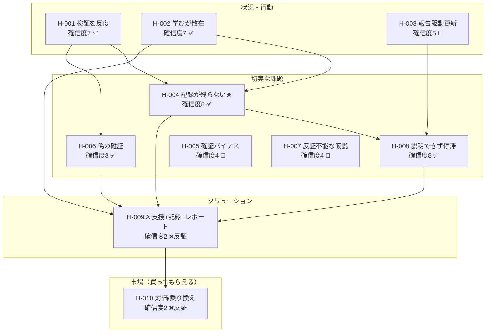

<!-- 生成物: /view list による再生成物。手編集禁止。記録の修正は各レコードで行い再生成する。生成基準日: 2026-07-18（ステージ FPF） -->
<!-- ⚠️ 検証済みの根拠はすべて架空のシミュレーションデータ（SELF-ACT-002/003）。実データ未検証。 -->

# 全仮説リスト

現在ステージ: **FPF**（重要度は FPF重点＝課題・自分たち＝8、その他＝4 で算出）

## バリューチェーン（行動 → 切実な課題 → 解決策 → 市場）

## 状況・行動仮説

| ID | タイトル | 確信度 | ステータス | 重要度 | 関連 |
|---|---|---|---|---|---|
| [[SELF-H-001]] | 実践者は作る前に検証を反復する | 7 | 検証済み | 4 | [[SELF-ACT-001]] [[SELF-ACT-002]] [[SELF-ACT-003]] |
| [[SELF-H-002]] | 学びが複数ツールに散在し集約されない | 7 | 検証済み | 4 | ← [[SELF-H-001]] |
| [[SELF-H-003]] | 仮説の更新は報告サイクルに駆動される | 5 | 検証中 | 4 | ← [[SELF-H-001]] |

## 課題仮説

| ID | タイトル | 確信度 | ステータス | 重要度 | 関連 |
|---|---|---|---|---|---|
| [[SELF-H-004]] | 記録が残らず散逸・属人化（★核心） | 8 | 検証済み | 8 | → [[SELF-H-008]] |
| [[SELF-H-006]] | 好意的反応を購買意向と取り違え偽の確証 | 8 | 検証済み | 8 | ~ [[SELF-H-005]] |
| [[SELF-H-008]] | 検証の根拠を経営層に説明できず停滞 | 8 | 検証済み | 8 | ← [[SELF-H-004]] |
| [[SELF-H-005]] | 確証バイアスで反証を軽視 | 4 | 検証中 | 8 | ~ [[SELF-H-006]] |
| [[SELF-H-007]] | 反証不能な曖昧仮説を成功基準なしで検証 | 4 | 検証中 | 8 | — |

## ソリューション／買ってもらえる仮説（LP先取り・反証）

| ID | タイトル | 確信度 | ステータス | ステージ |
|---|---|---|---|---|
| [[SELF-H-009]] | AI支援＋構造化記録が既存ツールより核心課題を解決する | 2 | 反証 | PSF |
| [[SELF-H-010]] | 実践者は対価を払い既存ツールから乗り換える | 2 | 反証 | SPF |

FPF から先取りで LP（[[SELF-ACT-004]]）検証 → **いずれも反証**。刺さらないのは「AIの深さ」と「記録形式（単独Wiki）」であり、課題そのもの（H-004/006/008）ではない。自分たち仮説は未起票（FPFで起票予定）。

## 次に検証すべき仮説（重要度高 × 確信度低 × 未検証/検証中/反証）

FPF の重点は**課題・自分たち仮説**。

1. **ソリューションのピボット（[[SELF-H-009]] の反証を受けて）** — 価値の芯を「記録＋確信度＋レポート」に絞りAIツッコミを任意化、記録形式を共同編集（Miro的）に寄せた案を再起票して検証。
2. **[[SELF-H-005]]**（確証バイアス, 重要度8/確信度4）— 自認は広いが実コストの証拠が薄い。実データで手戻りコストを確認。
3. **[[SELF-H-007]]**（反証不能な仮説, 重要度8/確信度4）— 同上。
4. **自分たち仮説（未起票）** — 「我々がこの課題を解くのに適した担い手か」を FPF で起票・検証。
5. **最優先の再検証**: 検証済み核心クラスタ（H-004/006/008）と反証（H-009/010）を**実データ**で確認し直す（現状は架空データ依存）。

## 検証済み仮説（証拠の留保つき）

| ID | 確信度 | 根拠 | 留保 |
|---|---|---|---|
| [[SELF-H-004]] | 8 | [[SELF-ACT-003]] 9/10 | ⚠️ 架空データ。実データ未検証 |
| [[SELF-H-006]] | 8 | [[SELF-ACT-003]] 行動追跡8/10 | ⚠️ 架空データ。実データ未検証 |
| [[SELF-H-008]] | 8 | [[SELF-ACT-003]] 9/10 | ⚠️ 架空データ。実データ未検証 |
| [[SELF-H-001]] | 7 | [[SELF-ACT-003]] | ⚠️ 架空データ。実データ未検証 |
| [[SELF-H-002]] | 7 | [[SELF-ACT-003]] 8/10 | ⚠️ 架空データ。実データ未検証 |

## タイプ別サマリ

| タイプ | 件数 | 検証済み | 検証中 | 未検証 | 反証 |
|---|---|---|---|---|---|
| 状況・行動仮説 | 3 | 2 | 1 | 0 | 0 |
| 課題仮説 | 5 | 3 | 2 | 0 | 0 |
| ソリューション仮説 | 1 | 0 | 0 | 0 | 1 |
| 買ってもらえる仮説 | 1 | 0 | 0 | 0 | 1 |
| 自分たち仮説 | 0 | — | — | — | — |
