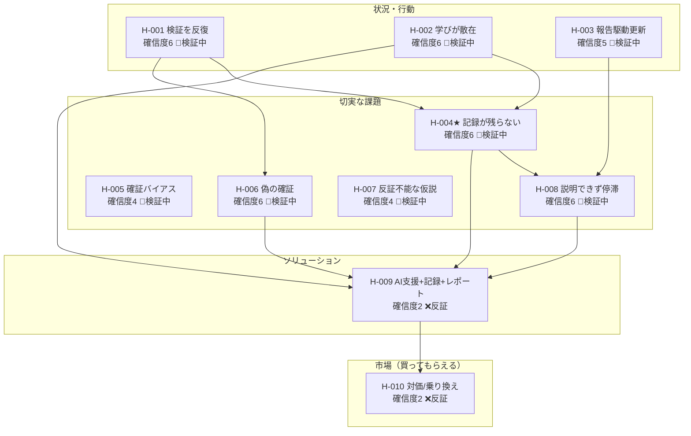

<!-- 生成物: gen_views.py list による機械生成。手編集禁止。`python3 tools/gen_views.py list` で再生成する。生成基準日: 2026-07-20（ステージ CPF） -->
<!-- ⚠️ 架空/シミュレーションデータを含む活動: [[SELF-ACT-002]] [[SELF-ACT-003]] [[SELF-ACT-004]] [[SELF-ACT-005]]。これら由来の確信度・判断は実データ未検証。 -->

# 全仮説リスト（self）

現在ステージ: **CPF**。重要度は CPF 重点タイプ=8・その他=4 で算出（frontmatter 射影）。★=核心仮説（`core`）。関連列は ← 派生元／→ 因果先（`leads-to`）／検証活動（ACT）。

## バリューチェーン（行動 → 切実な課題 → 解決策 → 市場）

## 状況・行動仮説

| ID | タイトル | 確信度 | ステータス | 重要度 | 関連 |
|---|---|---|---|---|---|
| [[SELF-H-001]] | 実践者は作る前に検証を反復する | 6 | 🔄検証中 | 8 | → [[SELF-H-004]] [[SELF-H-006]] ・ [[SELF-ACT-001]] [[SELF-ACT-002]] [[SELF-ACT-003]] [[SELF-ACT-005]] |
| [[SELF-H-002]] | 学びが複数ツールに散在し集約されない | 6 | 🔄検証中 | 8 | ← [[SELF-H-001]] ・ → [[SELF-H-004]] [[SELF-H-009]] ・ [[SELF-ACT-001]] [[SELF-ACT-002]] [[SELF-ACT-003]] [[SELF-ACT-005]] |
| [[SELF-H-003]] | 仮説の更新は報告サイクルに駆動される | 5 | 🔄検証中 | 8 | ← [[SELF-H-001]] ・ → [[SELF-H-008]] ・ [[SELF-ACT-001]] [[SELF-ACT-002]] |

## 課題仮説

| ID | タイトル | 確信度 | ステータス | 重要度 | 関連 |
|---|---|---|---|---|---|
| [[SELF-H-004]]★ | 記録が残らず散逸・属人化し過去の学びが忘れられる | 6 | 🔄検証中 | 8 | → [[SELF-H-008]] [[SELF-H-009]] ・ [[SELF-ACT-001]] [[SELF-ACT-002]] [[SELF-ACT-003]] [[SELF-ACT-005]] |
| [[SELF-H-006]] | 好意的反応を購買意向と取り違え偽の確証で前進する | 6 | 🔄検証中 | 8 | → [[SELF-H-009]] ・ [[SELF-ACT-001]] [[SELF-ACT-002]] [[SELF-ACT-003]] [[SELF-ACT-005]] |
| [[SELF-H-008]] | 検証の根拠を経営層に説明できず合意形成が停滞する | 6 | 🔄検証中 | 8 | ← [[SELF-H-004]] ・ → [[SELF-H-009]] ・ [[SELF-ACT-001]] [[SELF-ACT-002]] [[SELF-ACT-003]] [[SELF-ACT-005]] |
| [[SELF-H-005]] | 確証バイアスで反証を軽視し過大評価する | 4 | 🔄検証中 | 8 | [[SELF-ACT-001]] [[SELF-ACT-002]] |
| [[SELF-H-007]] | 反証不能な曖昧仮説を成功基準なしで検証する | 4 | 🔄検証中 | 8 | [[SELF-ACT-001]] [[SELF-ACT-002]] |

## ソリューション仮説

| ID | タイトル | 確信度 | ステータス | 重要度 | 関連 |
|---|---|---|---|---|---|
| [[SELF-H-009]] | AI支援＋構造化記録が既存ツールより核心課題を解決する | 2 | ❌反証 | 4 | ← [[SELF-H-004]] ・ → [[SELF-H-010]] ・ [[SELF-ACT-004]] |

## 買ってもらえる仮説

| ID | タイトル | 確信度 | ステータス | 重要度 | 関連 |
|---|---|---|---|---|---|
| [[SELF-H-010]] | 実践者は対価を払い既存ツールから乗り換える | 2 | ❌反証 | 4 | ← [[SELF-H-009]] ・ [[SELF-ACT-004]] |

## 次に検証すべき仮説（重要度8 × 確信度低 × 未検証/検証中）

- [[SELF-H-005]] 確証バイアスで反証を軽視し過大評価する（確信度4・検証中）
- [[SELF-H-007]] 反証不能な曖昧仮説を成功基準なしで検証する（確信度4・検証中）
- [[SELF-H-003]] 仮説の更新は報告サイクルに駆動される（確信度5・検証中）
- [[SELF-H-001]] 実践者は作る前に検証を反復する（確信度6・検証中）
- [[SELF-H-002]] 学びが複数ツールに散在し集約されない（確信度6・検証中）
- [[SELF-H-004]] 記録が残らず散逸・属人化し過去の学びが忘れられる（確信度6・検証中）
- [[SELF-H-006]] 好意的反応を購買意向と取り違え偽の確証で前進する（確信度6・検証中）
- [[SELF-H-008]] 検証の根拠を経営層に説明できず合意形成が停滞する（確信度6・検証中）

## タイプ別サマリ

| タイプ | 件数 | 検証済み | 検証中 | 未検証 | 反証 |
|---|---|---|---|---|---|
| 状況・行動仮説 | 3 | 0 | 3 | 0 | 0 |
| 課題仮説 | 5 | 0 | 5 | 0 | 0 |
| ソリューション仮説 | 1 | 0 | 0 | 0 | 1 |
| 買ってもらえる仮説 | 1 | 0 | 0 | 0 | 1 |
