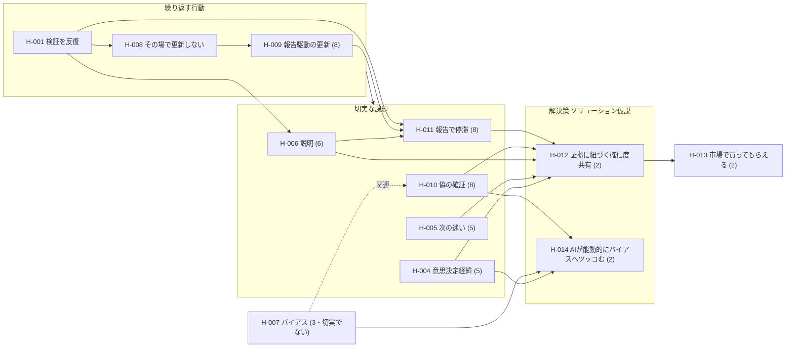

<!-- 生成物。手編集禁止。/view で再生成する。 -->

# 仮説一覧ビュー

生成日: 2026-07-17 ／ 現在ステージ: **PSF** ／ 仮説数: 12件（欠番 SELF-H-002・SELF-H-003）

> ステージは [[SELF-DEC-001]] で CPF→PSF に移行済み。重要度は現ステージ **PSF** の重点タイプ
> （ソリューション仮説＝8、それ以外＝4）で解決した値。検証の根拠 SELF-ACT-001/002 は**架空**（実データ未検証）。

## バリューチェーン（仮説どうしのつながり）

**繰り返し発生する行動 → その中の切実な課題 → 解決策を含んだプロダクト → 市場で買ってもらえる**。

> H-012 は**対外的な合意形成**（報告）に、H-014 は**実践者自身の規律**（バイアス制御・前進/巻き戻し）に効く姉妹ソリューション。

## 次に検証すべき仮説（現ステージ PSF: 重要度高 × 確信度低 × 未検証/検証中）

PSFの重点はソリューション仮説。**移行の狙いどおり、解決策の検証が最優先**。

| 順 | ID | タイトル | タイプ | 確信度 | ステータス | 重要度 | 検証計画 |
|---|---|---|---|---|---|---|---|
| 1 | [[SELF-H-012]] | 証拠に紐づく確信度の共有で報告の合意形成を早める | ソリューション | 2 | 未検証 | 8 | [[SELF-ACT-004]] モックデモ |
| 2 | [[SELF-H-014]] | AIが能動的にバイアスへツッコみ前進と巻き戻しの規律を強制する | ソリューション | 2 | 未検証 | 8 | [[SELF-ACT-003]] ドッグフーディング観察 |

> 買ってもらえる [[SELF-H-013]] は SPF、CPF由来の課題群（H-004〜H-008）は重点外（重要度4）となり並行検証。

## 全仮説（関連リンク付き）

| ID | タイトル | タイプ | 確信度 | ステータス | ステージ | 重要度(PSF) | 派生元 | 関連リンク |
|---|---|---|---|---|---|---|---|---|
| [[SELF-H-012]] | 証拠に紐づく確信度の共有で報告の合意形成を早める | ソリューション | 2 | 未検証 | PSF | 8 | — | 解く→[[SELF-H-011]] [[SELF-H-009]] [[SELF-H-010]] [[SELF-H-006]] ／ 次→[[SELF-H-013]] ／ [[SELF-ACT-002]] [[SELF-ACT-004]] |
| [[SELF-H-014]] | AIが能動的にバイアスへツッコみ前進と巻き戻しの規律を強制する | ソリューション | 2 | 未検証 | PSF | 8 | [[SELF-H-007]] | 解く→[[SELF-H-007]] [[SELF-H-010]] [[SELF-H-004]] ／ 姉妹→[[SELF-H-012]] ／ [[SELF-ACT-003]] |
| [[SELF-H-013]] | 解決策を含んだプロダクトは市場で買ってもらえる | 買ってもらえる | 2 | 未検証 | SPF | 4 | [[SELF-H-012]] | チェーンの締め |
| [[SELF-H-007]] | バイアスにとらわれ不毛な探索に時間を使う | 課題 | 3 | 検証中 | CPF | 4 | — | 解決策←[[SELF-H-014]] ／ 関連→[[SELF-H-010]]（切実でない） ／ [[SELF-ACT-001]] |
| [[SELF-H-001]] | 実践者は仮説検証を反復し説明しながら確信度を高めていく | 状況・行動 | 5 | 検証中 | CPF | 4 | — | 具体化→[[SELF-H-008]] ／ [[SELF-ACT-001]] |
| [[SELF-H-004]] | 意思決定の経緯が後から追えない | 課題 | 5 | 検証中 | CPF | 4 | — | 解決策←[[SELF-H-012]] [[SELF-H-014]] ／ [[SELF-ACT-001]] |
| [[SELF-H-005]] | 次に何を検証すべきか迷う | 課題 | 5 | 検証中 | CPF | 4 | — | 解決策←[[SELF-H-012]] ／ [[SELF-ACT-001]] |
| [[SELF-H-006]] | 検証活動の現状・方針を第三者に説明しづらい | 課題 | 6 | 検証中 | CPF | 4 | — | 派生先→[[SELF-H-011]] ／ 解決策←[[SELF-H-012]] ／ [[SELF-ACT-001]] |
| [[SELF-H-008]] | 学びは断片的に残すが仮説・確信度をその場で更新しない | 状況・行動 | 6 | 検証中 | CPF | 4 | [[SELF-H-001]] | 深掘り→[[SELF-H-009]] ／ [[SELF-ACT-001]] |
| [[SELF-H-009]] | 仮説の更新が学習時点でなく報告サイクルに駆動される | 状況・行動 | 8 | 検証済み | CPF | 4 | [[SELF-H-008]] | 解決策←[[SELF-H-012]] ／ [[SELF-ACT-001]] [[SELF-ACT-002]] |
| [[SELF-H-010]] | 好意的反応を検証成功と取り違え偽の確証で前進する | 課題 | 8 | 検証済み | CPF | 4 | — | 解決策←[[SELF-H-012]] [[SELF-H-014]] ／ [[SELF-ACT-001]] [[SELF-ACT-002]] |
| [[SELF-H-011]] | 報告でステークホルダーと見解が合わず前に進まない | 課題 | 8 | 検証済み | CPF | 4 | [[SELF-H-006]] | 解決策←[[SELF-H-012]] ／ [[SELF-ACT-002]] |

## 検証済み（確信度8・CPFの成果＝報告/合意形成クラスタ）

| ID | タイトル | タイプ | 確信度 | ステータス | 証拠の留保 |
|---|---|---|---|---|---|
| [[SELF-H-011]] | 報告でステークホルダーと見解が合わず前に進まない | 課題 | 8 | 検証済み | ⚠️架空データ（[[SELF-ACT-002]]）・実データ未検証 |
| [[SELF-H-009]] | 仮説の更新が学習時点でなく報告サイクルに駆動される | 状況・行動 | 8 | 検証済み | ⚠️架空データ（[[SELF-ACT-002]]）・実データ未検証 |
| [[SELF-H-010]] | 好意的反応を検証成功と取り違え偽の確証で前進する | 課題 | 8 | 検証済み | ⚠️架空データ（[[SELF-ACT-002]]）・実データ未検証 |

## タイプ別サマリ

| タイプ | 件数 | 確信度レンジ | ステータス |
|---|---|---|---|
| 状況・行動仮説 | 3 | 5〜8 | 検証中2・検証済み1 |
| 課題仮説 | 6 | 3〜8 | 検証中3・検証済み3 |
| ソリューション仮説 | 2 | 2 | 未検証2（**PSFの重点**） |
| 買ってもらえる仮説 | 1 | 2 | 未検証1 |
| 自分たち仮説 | 0 | — | — |

## 所見

- **CPF→PSF 移行済み**（[[SELF-DEC-001]]）。重点がソリューションに移り、次の最優先は [[SELF-H-012]]・[[SELF-H-014]] の検証（それぞれ [[SELF-ACT-004]] [[SELF-ACT-003]] を計画済み）。
- CPFの成果（[[SELF-H-011]] [[SELF-H-010]] [[SELF-H-009]]＝確信度8）はチェーンの上流として確定（ただし架空データ・実データ未検証）。
- 欠番 SELF-H-002・SELF-H-003 は取り下げ済み（`log.md` 参照）。
