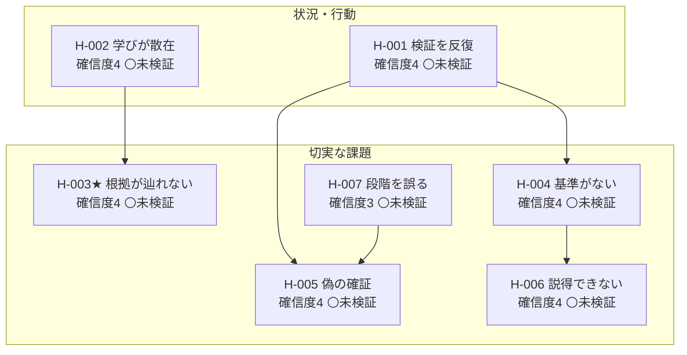

<!-- 生成物: gen_views.py list による機械生成。手編集禁止。`python3 tools/gen_views.py list` で再生成する。生成基準日: 2026-08-07（ステージ CPF） / ontology-version: 4 -->

# 全仮説リスト（self）

現在ステージ: **CPF**。重要度は CPF 重点タイプ=8・その他=4 で算出（frontmatter 射影）。★=核心仮説（`core`）。関連列は ← 派生元／→ 因果先（`leads-to`）／検証活動 TEST・学び LEARN。

## バリューチェーン（行動 → 切実な課題 → 解決策 → 市場）

```mermaid
flowchart TB
    subgraph beh["状況・行動"]
      SELF_H_001["H-001 検証を反復<br/>確信度4 ⚪未検証"]
      SELF_H_002["H-002 学びが散在<br/>確信度4 ⚪未検証"]
    end
    subgraph prob["切実な課題"]
      SELF_H_003["H-003★ 根拠が辿れない<br/>確信度4 ⚪未検証"]
      SELF_H_004["H-004 基準がない<br/>確信度4 ⚪未検証"]
      SELF_H_005["H-005 偽の確証<br/>確信度4 ⚪未検証"]
      SELF_H_006["H-006 説得できない<br/>確信度4 ⚪未検証"]
      SELF_H_007["H-007 段階を誤る<br/>確信度3 ⚪未検証"]
    end
    SELF_H_001 --> SELF_H_004
    SELF_H_001 --> SELF_H_005
    SELF_H_002 --> SELF_H_003
    SELF_H_004 --> SELF_H_006
    SELF_H_007 --> SELF_H_005
```

## 状況・行動仮説

| ID | タイトル | 確信度 | ステータス | 重要度 | 関連 | 直近の根拠 |
|---|---|---|---|---|---|---|
| [[SELF-H-001]] | 実践者は作る前に顧客と話し、検証をセット単位で反復している | 4 | ⚪未検証 | 8 | → [[SELF-H-004]] [[SELF-H-005]] ・ [[SELF-LEARN-001]] [[SELF-TEST-001]] | 〈二次〉デスクリサーチ。S1 Blank（Customer Development）・S… |
| [[SELF-H-002]] | 検証で得た学びは複数のツールに分かれて記録されている | 4 | ⚪未検証 | 8 | → [[SELF-H-003]] ・ [[SELF-LEARN-001]] [[SELF-TEST-001]] | 〈二次〉デスクリサーチ。S6 NN/g「インサイトがファイル・忘れられたフォルダ・無数の… |

## 課題仮説

| ID | タイトル | 確信度 | ステータス | 重要度 | 関連 | 直近の根拠 |
|---|---|---|---|---|---|---|
| [[SELF-H-003]]★ | 「なぜそう決めたか」を後から辿れず、過去の学びが失われる | 4 | ⚪未検証 | 8 | [[SELF-LEARN-001]] [[SELF-TEST-001]] | 〈二次〉デスクリサーチ P6。Strategyzer（Learning Card の導入… |
| [[SELF-H-004]] | 成功基準を決めずに検証するため、話した量に対して学びが残らない | 4 | ⚪未検証 | 8 | → [[SELF-H-006]] ・ [[SELF-LEARN-001]] [[SELF-TEST-001]] | 〈二次〉デスクリサーチ P5。Strategyzer 自身が「大量に話したのに学べなかっ… |
| [[SELF-H-005]] | 好意的な反応を成果と取り違え、偽の確証のまま前に進む | 4 | ⚪未検証 | 8 | [[SELF-LEARN-001]] [[SELF-TEST-001]] | 〈二次〉デスクリサーチ P3・P4。P3 Forbes「エゴと確証バイアスが結果の客観的… |
| [[SELF-H-006]] | 辿り着き方を示せず、検証結果をステークホルダーに否定される | 4 | ⚪未検証 | 8 | [[SELF-LEARN-002]] | 〈二次〉デスクリサーチ P7＋P8。Torres「結論だけ見せる（辿り着き方を見せない）… |
| [[SELF-H-007]] | 事業の段階を判定する基準がなく、前例と売上目標が方法を決めてしまう | 3 | ⚪未検証 | 8 | → [[SELF-H-005]] | 〈二次〉[[SELF-TEST-001]] の1名目（対象者A・支援する立場）から聞いた… |

## 次に検証すべき仮説（重要度8 × 確信度低 × 未検証/検証中・下流＝leads-to 推移閉包。⚠️＝検証活動なし＝最優先）

- [[SELF-H-007]] 事業の段階を判定する基準がなく、前例と売上目標が方法を決めてしまう（確信度3・未検証 ・下流1） ⚠️未着手（検証活動なし）
- [[SELF-H-001]] 実践者は作る前に顧客と話し、検証をセット単位で反復している（確信度4・未検証 ・下流3）
- [[SELF-H-002]] 検証で得た学びは複数のツールに分かれて記録されている（確信度4・未検証 ・下流1）
- [[SELF-H-004]] 成功基準を決めずに検証するため、話した量に対して学びが残らない（確信度4・未検証 ・下流1）
- [[SELF-H-003]] 「なぜそう決めたか」を後から辿れず、過去の学びが失われる（確信度4・未検証）
- [[SELF-H-005]] 好意的な反応を成果と取り違え、偽の確証のまま前に進む（確信度4・未検証）
- [[SELF-H-006]] 辿り着き方を示せず、検証結果をステークホルダーに否定される（確信度4・未検証）

## タイプ別サマリ

| タイプ | 件数 | 検証済み | 検証中 | 未検証 | 反証 |
|---|---|---|---|---|---|
| 状況・行動仮説 | 2 | 0 | 0 | 2 | 0 |
| 課題仮説 | 5 | 0 | 0 | 5 | 0 |
