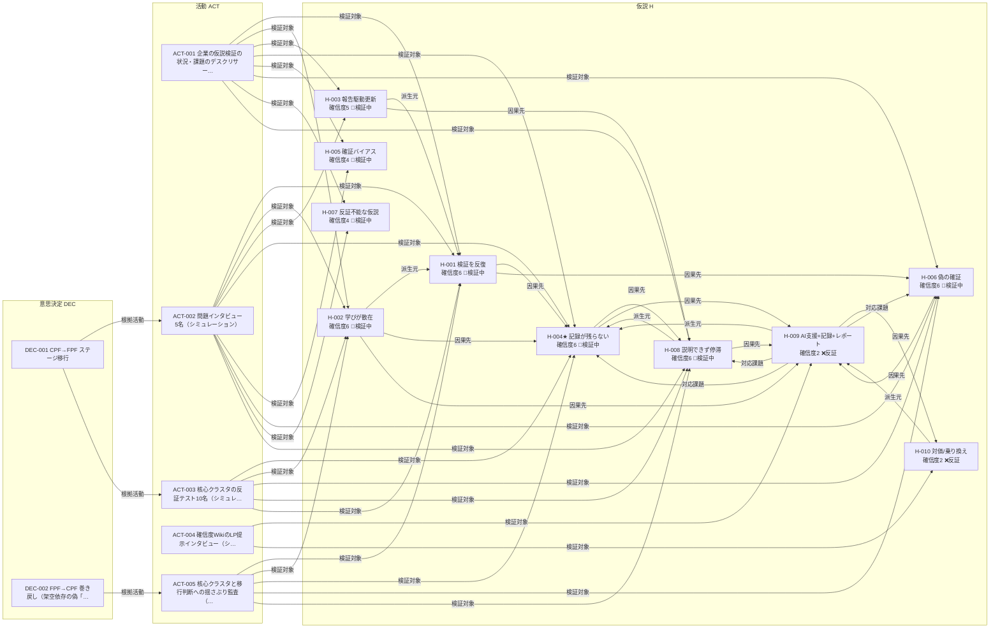

<!-- 生成物: gen_views.py relations による機械生成。手編集禁止。`python3 tools/gen_views.py relations` で再生成する。生成基準日: 2026-07-21（ステージ CPF） -->
<!-- ⚠️ 架空/シミュレーションデータを含む活動: [[SELF-ACT-002]] [[SELF-ACT-003]] [[SELF-ACT-004]] [[SELF-ACT-005]]。これら由来の確信度・判断は実データ未検証。 -->

# 関係グラフ（self）

レコード間の型付きリンク（オントロジーの関係）を frontmatter から射影する。ノード=レコード、矢印=関係（ラベル=関係名）。関係の定義は [ontology.md](../../../../ontology.md) を参照。

## 型付き関係グラフ

## 関係インデックス

### 派生元（`derived-from`: H→H）

| 始点 | 関係 | 終点 |
|---|---|---|
| [[SELF-H-002]] | 派生元 → | [[SELF-H-001]] |
| [[SELF-H-003]] | 派生元 → | [[SELF-H-001]] |
| [[SELF-H-008]] | 派生元 → | [[SELF-H-004]] |
| [[SELF-H-009]] | 派生元 → | [[SELF-H-004]] |
| [[SELF-H-010]] | 派生元 → | [[SELF-H-009]] |

### 因果先（`leads-to`: H→H）

| 始点 | 関係 | 終点 |
|---|---|---|
| [[SELF-H-001]] | 因果先 → | [[SELF-H-004]] |
| [[SELF-H-001]] | 因果先 → | [[SELF-H-006]] |
| [[SELF-H-002]] | 因果先 → | [[SELF-H-004]] |
| [[SELF-H-002]] | 因果先 → | [[SELF-H-009]] |
| [[SELF-H-003]] | 因果先 → | [[SELF-H-008]] |
| [[SELF-H-004]] | 因果先 → | [[SELF-H-008]] |
| [[SELF-H-004]] | 因果先 → | [[SELF-H-009]] |
| [[SELF-H-006]] | 因果先 → | [[SELF-H-009]] |
| [[SELF-H-008]] | 因果先 → | [[SELF-H-009]] |
| [[SELF-H-009]] | 因果先 → | [[SELF-H-010]] |

### 対応課題（`addresses`: H→H）

| 始点 | 関係 | 終点 |
|---|---|---|
| [[SELF-H-009]] | 対応課題 → | [[SELF-H-004]] |
| [[SELF-H-009]] | 対応課題 → | [[SELF-H-006]] |
| [[SELF-H-009]] | 対応課題 → | [[SELF-H-008]] |

### 検証対象（`hypotheses`: ACT→H）

| 始点 | 関係 | 終点 |
|---|---|---|
| [[SELF-ACT-001]] | 検証対象 → | [[SELF-H-001]] |
| [[SELF-ACT-001]] | 検証対象 → | [[SELF-H-002]] |
| [[SELF-ACT-001]] | 検証対象 → | [[SELF-H-003]] |
| [[SELF-ACT-001]] | 検証対象 → | [[SELF-H-004]] |
| [[SELF-ACT-001]] | 検証対象 → | [[SELF-H-005]] |
| [[SELF-ACT-001]] | 検証対象 → | [[SELF-H-006]] |
| [[SELF-ACT-001]] | 検証対象 → | [[SELF-H-007]] |
| [[SELF-ACT-001]] | 検証対象 → | [[SELF-H-008]] |
| [[SELF-ACT-002]] | 検証対象 → | [[SELF-H-001]] |
| [[SELF-ACT-002]] | 検証対象 → | [[SELF-H-002]] |
| [[SELF-ACT-002]] | 検証対象 → | [[SELF-H-003]] |
| [[SELF-ACT-002]] | 検証対象 → | [[SELF-H-004]] |
| [[SELF-ACT-002]] | 検証対象 → | [[SELF-H-005]] |
| [[SELF-ACT-002]] | 検証対象 → | [[SELF-H-006]] |
| [[SELF-ACT-002]] | 検証対象 → | [[SELF-H-007]] |
| [[SELF-ACT-002]] | 検証対象 → | [[SELF-H-008]] |
| [[SELF-ACT-003]] | 検証対象 → | [[SELF-H-004]] |
| [[SELF-ACT-003]] | 検証対象 → | [[SELF-H-002]] |
| [[SELF-ACT-003]] | 検証対象 → | [[SELF-H-006]] |
| [[SELF-ACT-003]] | 検証対象 → | [[SELF-H-008]] |
| [[SELF-ACT-003]] | 検証対象 → | [[SELF-H-001]] |
| [[SELF-ACT-004]] | 検証対象 → | [[SELF-H-009]] |
| [[SELF-ACT-004]] | 検証対象 → | [[SELF-H-010]] |
| [[SELF-ACT-005]] | 検証対象 → | [[SELF-H-001]] |
| [[SELF-ACT-005]] | 検証対象 → | [[SELF-H-002]] |
| [[SELF-ACT-005]] | 検証対象 → | [[SELF-H-004]] |
| [[SELF-ACT-005]] | 検証対象 → | [[SELF-H-006]] |
| [[SELF-ACT-005]] | 検証対象 → | [[SELF-H-008]] |

### 根拠活動（`based-on`: DEC→ACT）

| 始点 | 関係 | 終点 |
|---|---|---|
| [[SELF-DEC-001]] | 根拠活動 → | [[SELF-ACT-002]] |
| [[SELF-DEC-001]] | 根拠活動 → | [[SELF-ACT-003]] |
| [[SELF-DEC-002]] | 根拠活動 → | [[SELF-ACT-005]] |

## バックリンク索引（誰から・どの関係で参照されているか）

- [[SELF-ACT-002]] ← 導いた判断: [[SELF-DEC-001]]
- [[SELF-ACT-003]] ← 導いた判断: [[SELF-DEC-001]]
- [[SELF-ACT-005]] ← 導いた判断: [[SELF-DEC-002]]
- [[SELF-H-001]] ← 派生先: [[SELF-H-002]] [[SELF-H-003]] ／ 検証活動: [[SELF-ACT-001]] [[SELF-ACT-002]] [[SELF-ACT-003]] [[SELF-ACT-005]]
- [[SELF-H-002]] ← 検証活動: [[SELF-ACT-001]] [[SELF-ACT-002]] [[SELF-ACT-003]] [[SELF-ACT-005]]
- [[SELF-H-003]] ← 検証活動: [[SELF-ACT-001]] [[SELF-ACT-002]]
- [[SELF-H-004]] ← 因果元: [[SELF-H-001]] [[SELF-H-002]] ／ 派生先: [[SELF-H-008]] [[SELF-H-009]] ／ 対応する価値: [[SELF-H-009]] ／ 検証活動: [[SELF-ACT-001]] [[SELF-ACT-002]] [[SELF-ACT-003]] [[SELF-ACT-005]]
- [[SELF-H-005]] ← 検証活動: [[SELF-ACT-001]] [[SELF-ACT-002]]
- [[SELF-H-006]] ← 因果元: [[SELF-H-001]] ／ 対応する価値: [[SELF-H-009]] ／ 検証活動: [[SELF-ACT-001]] [[SELF-ACT-002]] [[SELF-ACT-003]] [[SELF-ACT-005]]
- [[SELF-H-007]] ← 検証活動: [[SELF-ACT-001]] [[SELF-ACT-002]]
- [[SELF-H-008]] ← 因果元: [[SELF-H-003]] [[SELF-H-004]] ／ 対応する価値: [[SELF-H-009]] ／ 検証活動: [[SELF-ACT-001]] [[SELF-ACT-002]] [[SELF-ACT-003]] [[SELF-ACT-005]]
- [[SELF-H-009]] ← 因果元: [[SELF-H-002]] [[SELF-H-004]] [[SELF-H-006]] [[SELF-H-008]] ／ 派生先: [[SELF-H-010]] ／ 検証活動: [[SELF-ACT-004]]
- [[SELF-H-010]] ← 因果元: [[SELF-H-009]] ／ 検証活動: [[SELF-ACT-004]]

## 課題↔ソリューション フィット（addresses）

ソリューション仮説の `addresses`（対応課題）で突き合わせる。反証された価値は ⚠️反証 を付す（実質的な対応にならない）。

| 課題 | 対応する価値（ソリューション） |
|---|---|
| [[SELF-H-004]] 記録が残らず散逸・属人化し過去の学びが忘れられる | [[SELF-H-009]]⚠️反証 |
| [[SELF-H-005]] 確証バイアスで反証を軽視し過大評価する | **空白** |
| [[SELF-H-006]] 好意的反応を購買意向と取り違え偽の確証で前進する | [[SELF-H-009]]⚠️反証 |
| [[SELF-H-007]] 反証不能な曖昧仮説を成功基準なしで検証する | **空白** |
| [[SELF-H-008]] 検証の根拠を経営層に説明できず合意形成が停滞する | [[SELF-H-009]]⚠️反証 |

- **未カバーの課題**（対応する価値がない）: [[SELF-H-005]] [[SELF-H-007]]
- **実質未カバー**（反証された価値でしか対応されていない）: [[SELF-H-004]] [[SELF-H-006]] [[SELF-H-008]]
- **課題なき解決**（addresses 先が無いソリューション仮説）: なし
