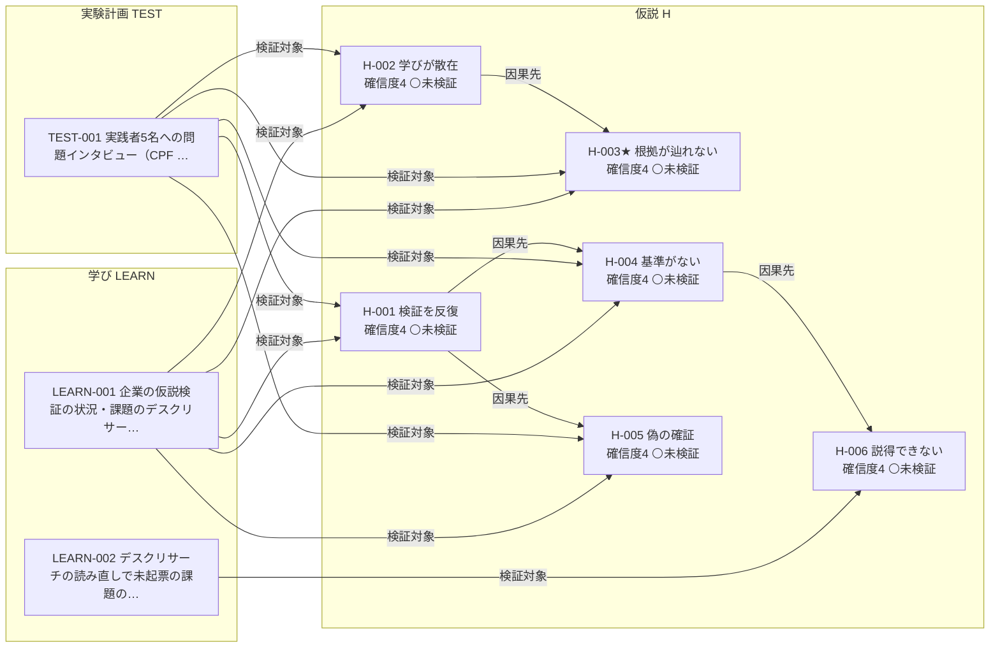

<!-- 生成物: gen_views.py relations による機械生成。手編集禁止。`python3 tools/gen_views.py relations` で再生成する。生成基準日: 2026-08-02（ステージ CPF） / ontology-version: 2 -->

# 関係グラフ（self）

レコード間の型付きリンク（オントロジーの関係）を frontmatter から射影する。ノード=レコード、矢印=関係（ラベル=関係名）。関係の定義は [ontology.md](../../../../ontology.md) を参照。

## 型付き関係グラフ

```mermaid
flowchart LR
    subgraph H["仮説 H"]
      SELF_H_001["H-001 検証を反復<br/>確信度4 ⚪未検証"]
      SELF_H_002["H-002 学びが散在<br/>確信度4 ⚪未検証"]
      SELF_H_003["H-003★ 根拠が辿れない<br/>確信度4 ⚪未検証"]
      SELF_H_004["H-004 基準がない<br/>確信度4 ⚪未検証"]
      SELF_H_005["H-005 偽の確証<br/>確信度4 ⚪未検証"]
      SELF_H_006["H-006 説得できない<br/>確信度4 ⚪未検証"]
    end
    subgraph TEST["実験計画 TEST"]
      SELF_TEST_001["TEST-001 実践者5名への問題インタビュー（CPF …"]
    end
    subgraph LEARN["学び LEARN"]
      SELF_LEARN_001["LEARN-001 企業の仮説検証の状況・課題のデスクリサー…"]
      SELF_LEARN_002["LEARN-002 デスクリサーチの読み直しで未起票の課題の…"]
    end
    SELF_H_001 -->|因果先| SELF_H_004
    SELF_H_001 -->|因果先| SELF_H_005
    SELF_H_002 -->|因果先| SELF_H_003
    SELF_H_004 -->|因果先| SELF_H_006
    SELF_TEST_001 -->|検証対象| SELF_H_001
    SELF_TEST_001 -->|検証対象| SELF_H_002
    SELF_TEST_001 -->|検証対象| SELF_H_003
    SELF_TEST_001 -->|検証対象| SELF_H_004
    SELF_TEST_001 -->|検証対象| SELF_H_005
    SELF_LEARN_001 -->|検証対象| SELF_H_001
    SELF_LEARN_001 -->|検証対象| SELF_H_002
    SELF_LEARN_001 -->|検証対象| SELF_H_003
    SELF_LEARN_001 -->|検証対象| SELF_H_004
    SELF_LEARN_001 -->|検証対象| SELF_H_005
    SELF_LEARN_002 -->|検証対象| SELF_H_006
```

## 関係インデックス

### 派生元（`derived-from`: H→H）

（該当なし）

### 因果先（`leads-to`: H→H）

| 始点 | 関係 | 終点 |
|---|---|---|
| [[SELF-H-001]] | 因果先 → | [[SELF-H-004]] |
| [[SELF-H-001]] | 因果先 → | [[SELF-H-005]] |
| [[SELF-H-002]] | 因果先 → | [[SELF-H-003]] |
| [[SELF-H-004]] | 因果先 → | [[SELF-H-006]] |

### 対応課題（`addresses`: H→H）

（該当なし）

### 検証対象（`hypotheses`: LEARN/TEST→H）

| 始点 | 関係 | 終点 |
|---|---|---|
| [[SELF-TEST-001]] | 検証対象 → | [[SELF-H-001]] |
| [[SELF-TEST-001]] | 検証対象 → | [[SELF-H-002]] |
| [[SELF-TEST-001]] | 検証対象 → | [[SELF-H-003]] |
| [[SELF-TEST-001]] | 検証対象 → | [[SELF-H-004]] |
| [[SELF-TEST-001]] | 検証対象 → | [[SELF-H-005]] |
| [[SELF-LEARN-001]] | 検証対象 → | [[SELF-H-001]] |
| [[SELF-LEARN-001]] | 検証対象 → | [[SELF-H-002]] |
| [[SELF-LEARN-001]] | 検証対象 → | [[SELF-H-003]] |
| [[SELF-LEARN-001]] | 検証対象 → | [[SELF-H-004]] |
| [[SELF-LEARN-001]] | 検証対象 → | [[SELF-H-005]] |
| [[SELF-LEARN-002]] | 検証対象 → | [[SELF-H-006]] |

### 実験計画（`learns-from`: LEARN→TEST）

（該当なし）

### 根拠活動（`based-on`: DEC→LEARN/TEST）

（該当なし）

## バックリンク索引（誰から・どの関係で参照されているか）

- [[SELF-H-001]] ← 検証活動: [[SELF-TEST-001]] [[SELF-LEARN-001]]
- [[SELF-H-002]] ← 検証活動: [[SELF-TEST-001]] [[SELF-LEARN-001]]
- [[SELF-H-003]] ← 因果元: [[SELF-H-002]] ／ 検証活動: [[SELF-TEST-001]] [[SELF-LEARN-001]]
- [[SELF-H-004]] ← 因果元: [[SELF-H-001]] ／ 検証活動: [[SELF-TEST-001]] [[SELF-LEARN-001]]
- [[SELF-H-005]] ← 因果元: [[SELF-H-001]] ／ 検証活動: [[SELF-TEST-001]] [[SELF-LEARN-001]]
- [[SELF-H-006]] ← 因果元: [[SELF-H-004]] ／ 検証活動: [[SELF-LEARN-002]]

## グラフ診断

グラフ全体の欠落・偏りを機械算出する（個別の辺の型検証は `/lint` の担当）。

- **規模**: ノード 9 ／ 辺 15 ／ **辺÷ノード = 1.67**（健全な中間域）
- **連結成分**: 1（最大成分 9 ノード）。単一成分＝全レコードが関係で繋がっている
- **孤立仮説**（どの関係も持たない）: なし
- **ハブ**（次数上位＝コーパスを束ねているレコード）: [[SELF-LEARN-001]](5) [[SELF-TEST-001]](5) [[SELF-H-001]](4) [[SELF-H-004]](4) [[SELF-H-002]](3)
- **下流依存度**（`leads-to` の推移閉包＝崩れると波及が大きい背骨）: [[SELF-H-001]](3) [[SELF-H-002]](1) [[SELF-H-004]](1)
- **未取り込みの生データ**（どの学びの `sources` からも参照されていない）: なし
