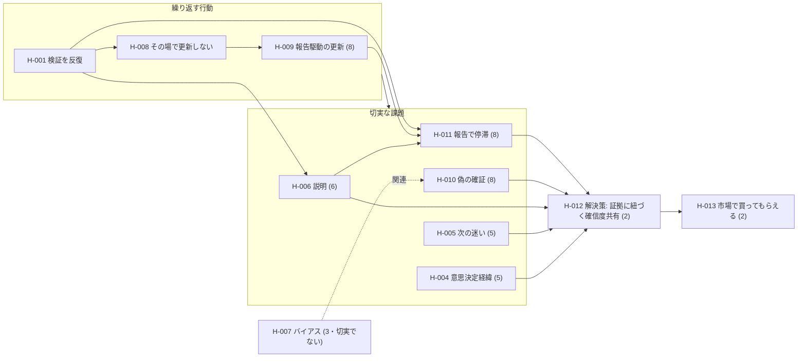

<!-- 生成物。手編集禁止。/view で再生成する。 -->

# 仮説一覧ビュー

生成日: 2026-07-16 ／ 現在ステージ: **CPF** ／ 仮説数: 11件（欠番 H-002・H-003）

> ACT-001（初回5名）・ACT-002（追加10名・反証つき／いずれも架空）を `/ingest` 済み。値はその反映後。

## バリューチェーン（仮説どうしのつながり）

**繰り返し発生する行動 → その中の切実な課題 → 解決策を含んだプロダクト → 市場で買ってもらえる**、という筋で仮説が連なる。

- 行動（[[H-001]]／派生 [[H-008]]→[[H-009]]）の中に、切実な課題群が発生する。
- 切実な課題（[[H-011]] [[H-010]] [[H-006]] [[H-005]] [[H-004]]）を、解決策 [[H-012]] を含むプロダクトが解く。
- その対価として市場で買ってもらえる（[[H-013]]）。
- [[H-007]] は課題だが「切実でない」（自認は高いが実コスト0）ため本筋から外れる。

## 全仮説（関連リンク付き）

| ID | タイトル | タイプ | 確信度 | ステータス | 派生元 | 関連リンク（解決／派生先／検証活動） |
|---|---|---|---|---|---|---|
| [[H-001]] | 実践者は仮説検証を反復し説明しながら確信度を高めていく | 状況・行動 | 5 | 検証中 | — | 具体化→[[H-008]] ／ [[ACT-001]] |
| [[H-008]] | 学びは断片的に残すが仮説・確信度をその場で更新しない | 状況・行動 | 6 | 検証中 | [[H-001]] | 深掘り→[[H-009]] ／ [[ACT-001]] |
| [[H-009]] | 仮説の更新が学習時点でなく報告サイクルに駆動される | 状況・行動 | 8 | 検証済み | [[H-008]] | 解決策←[[H-012]] ／ [[ACT-001]] [[ACT-002]] |
| [[H-004]] | 意思決定の経緯が後から追えない | 課題 | 5 | 検証中 | — | 解決策←[[H-012]] ／ [[ACT-001]] |
| [[H-005]] | 次に何を検証すべきか迷う | 課題 | 5 | 検証中 | — | 解決策←[[H-012]] ／ [[ACT-001]] |
| [[H-006]] | 検証活動の現状・方針を第三者に説明しづらい | 課題 | 6 | 検証中 | — | 派生先→[[H-011]] ／ 解決策←[[H-012]] ／ [[ACT-001]] |
| [[H-007]] | バイアスにとらわれ不毛な探索に時間を使う | 課題 | 3 | 検証中 | — | 関連→[[H-010]]（切実でない） ／ [[ACT-001]] |
| [[H-010]] | 好意的反応を検証成功と取り違え偽の確証で前進する | 課題 | 8 | 検証済み | — | 解決策←[[H-012]] ／ [[ACT-001]] [[ACT-002]] |
| [[H-011]] | 報告でステークホルダーと見解が合わず前に進まない | 課題 | 8 | 検証済み | [[H-006]] | 解決策←[[H-012]] ／ [[ACT-002]] |
| [[H-012]] | 証拠に紐づく確信度の共有で報告の合意形成を早める | ソリューション | 2 | 未検証 | — | 解く→[[H-011]] [[H-009]] [[H-010]] [[H-006]] ／ 次→[[H-013]] ／ [[ACT-002]] |
| [[H-013]] | 解決策を含んだプロダクトは市場で買ってもらえる | 買ってもらえる | 2 | 未検証 | [[H-012]] | チェーンの締め（SPF/PMFで検証） |

## 次に検証すべき仮説（重要度高 × 確信度低 × 未検証/検証中）

重要度は `importance: auto` を CLAUDE.md「ステージ→重点仮説タイプ」で解決（CPF重点＝状況・行動／課題＝8、非重点＝4）。

| 順 | ID | タイトル | タイプ | 確信度 | ステータス | 重要度 |
|---|---|---|---|---|---|---|
| 1 | [[H-007]] | バイアスにとらわれ不毛な探索に時間を使う | 課題 | 3 | 検証中 | 8 |
| 2 | [[H-001]] | 実践者は仮説検証を反復し説明しながら確信度を高めていく | 状況・行動 | 5 | 検証中 | 8 |
| 3 | [[H-004]] | 意思決定の経緯が後から追えない | 課題 | 5 | 検証中 | 8 |
| 4 | [[H-005]] | 次に何を検証すべきか迷う | 課題 | 5 | 検証中 | 8 |

> H-007 は「切実でない」と判明済み。無理に上げず、ソリューションの主眼から外す判断材料として扱う。

## 検証済み（確信度8・報告/合意形成クラスタ）

| ID | タイトル | タイプ | 確信度 | ステータス |
|---|---|---|---|---|
| [[H-011]] | 報告でステークホルダーと見解が合わず前に進まない | 課題 | 8 | 検証済み |
| [[H-009]] | 仮説の更新が学習時点でなく報告サイクルに駆動される | 状況・行動 | 8 | 検証済み |
| [[H-010]] | 好意的反応を検証成功と取り違え偽の確証で前進する | 課題 | 8 | 検証済み |

## タイプ別サマリ

| タイプ | 件数 | 確信度レンジ | ステータス |
|---|---|---|---|
| 状況・行動仮説 | 3 | 5〜8 | 検証中2・検証済み1 |
| 課題仮説 | 6 | 3〜8 | 検証中3・検証済み3 |
| ソリューション仮説 | 1 | 2 | 未検証1 |
| 買ってもらえる仮説 | 1 | 2 | 未検証1 |
| 自分たち仮説 | 0 | — | — |

## 所見

- **バリューチェーンが CPF→PSF→SPF まで一本の筋で繋がった**（行動 [[H-001]] → 切実な課題 [[H-011]] 他 → 解決策 [[H-012]] → 買ってもらえる [[H-013]]）。
- 中核課題クラスタ（[[H-011]] [[H-009]] [[H-010]]）は確信度8で検証済み。
- 未検証の下流（[[H-012]] [[H-013]]）は今後のステージ（PSF/SPF）で検証する。
- 注意: ACT-001/ACT-002 は**架空・デモ/シミュレーション**。実データでの再検証が前提。
